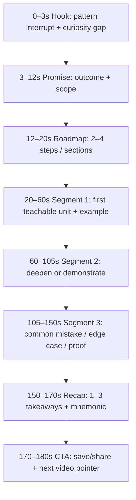

# Structure of Viral 2–3 Minute Education Videos

## Executive summary

Two–three minute teaching videos that reach “viral” distribution almost always solve the same optimisation problem: deliver one learnable unit while sustaining continuous perceived progress, so platform ranking systems keep distributing the video to additional viewers. Across short-form feeds (TikTok, Instagram Reels, YouTube Shorts) and “standard” YouTube uploads, the highest-leverage design variable is the opening window (first seconds through first ~30 seconds), because audience retention curves tend to show the steepest drop early, and platforms explicitly surface metrics and guidance that focus creators on that early retention behaviour. citeturn23view0turn3search12turn9view0turn19search1

Platform documentation and research converge on a practical definition of virality for 2–3 minute education: (a) high average watch time and completion, (b) high “share-alike” actions (shares, saves, sends), and (c) packaging (title/cover/thumbnail) that matches the video’s first seconds so viewers feel immediate satisfaction rather than click regret. citeturn12view0turn23view0turn12view1turn19search1turn22view0

Most viral teaching videos in this length range cluster into six perennial formats. Each is essentially a different answer to “How do I keep perceived progress monotonic for 120–180 seconds?”:

| Perennial format | Core promise | Why it holds attention in 2–3 minutes |
|---|---|---|
| One idea explainer (What-Why-How) | “You will understand X quickly” | Continuous comprehension gain; easy to signal progress with on-screen headings citeturn27view0turn23view0 |
| Misconception reversal (Myth → truth) | “What you believe about X is wrong” | Curiosity gap plus repeated mini-reveals; tension resolves at the end citeturn21view0turn13search3turn9view0 |
| Micro-tutorial (Do this in 3 steps) | “You can do X today” | Clear step markers; rapid payoff; supports saves and replays citeturn27view0turn12view1turn19search1 |
| Demonstration (Before/after + mechanism) | “Watch the change, then learn why” | Visual proof early, mechanism later; strong in vertical full-screen feeds citeturn12view1turn23view0 |
| Worked example (Solve one problem live) | “Copy this method” | Attention stays on the evolving artefact; natural “progress bar” citeturn27view0turn23view0 |
| Mini case story (Story → lesson → general rule) | “A true story that teaches a rule” | Narrative drive plus actionable takeaway supports shares citeturn22view0turn12view2 |

A high-performing 2–3 minute structure is usually a tight sequence of beats: hook (0–3s), promise + framing (3–12s), roadmap (12–20s), 3–5 value segments (20–150s), recap (150–170s), CTA (170–180s). This aligns with YouTube’s own emphasis on the intro window (often treated as ~30 seconds in audience retention analysis) and with short-form measurement conventions emphasising very early view thresholds (for example “2-second views”). citeturn23view0turn19search1turn9view0

## Method and evidence base

This report synthesises three evidence streams:

First, platform documentation and platform-adjacent primary sources: YouTube Help and YouTube’s official blog for Shorts length classification, recommendation surfaces, retention and packaging guidance, and in-platform A/B testing. citeturn10view3turn2search3turn12view2turn12view0turn17view0turn18view0  
TikTok for Business and TikTok Ads Help were used for metric definitions (watch time, completion rate, early view thresholds) and for “native creative” format guidance that directly maps onto organic education videos even when written for advertisers. citeturn12view1turn19search1turn19search0turn19search5  
Instagram’s primary access was partially constrained by login and rate limits during collection, so Instagram-specific length, experimentation, and practical cover guidance relies on accessible creator announcements, the Trial Reels announcement snippet, and reputable secondary summaries where needed. citeturn2search1turn2search4turn2search10turn16search0turn15search12

Second, peer-reviewed research in psychology, marketing, and platform studies, used to ground hook design (curiosity gaps, emotional activation) and sharing behaviour. citeturn21view0turn22view0turn22view2turn9view0

Third, an illustrative exemplar corpus: 32 public YouTube videos surfaced through queries explicitly targeting 2–3 minute educational explainers and 3-minute Shorts. This corpus was used to sanity-check beat timing and the prevalence of format archetypes, while acknowledging selection bias toward “explained in X minutes” titling conventions. A full, cross-platform corpus with stable URLs for TikTok and a large set of Reels was blocked by tool access constraints (TikTok domain robots restrictions; Instagram creator pages rate-limited during retrieval). citeturn14search0turn14search1turn14search8turn14search12turn14search24turn14search33turn14search3turn2search1turn16search0

### Exemplar set used for structural spot-checks

All examples below are 2–3 minute education/teaching style videos, split between standard YouTube uploads and YouTube Shorts. The list is representative rather than exhaustive.

| Platform surface | Example video |
|---|---|
| YouTube upload | “Blood Flow through the Heart in 2 MINUTES” citeturn14search0 |
| YouTube upload | “Pivot Tables Explained in 3 Minutes” citeturn14search1 |
| YouTube upload | “Evolution Explained in 2 Minutes” citeturn14search8 |
| YouTube upload | “Quantum Mechanics Explained in 2 Minutes” citeturn14search16 |
| YouTube upload | “2-Minute Neuroscience: Divisions of the Nervous System” citeturn14search12 |
| YouTube upload | “2-Minute Neuroscience: Synaptic Transmission” citeturn14search24 |
| YouTube upload | “2-Minute Neuroscience: Dopamine” citeturn14search36 |
| YouTube upload | “A Light History of Light in 2 Minutes” citeturn14search28 |
| YouTube upload | “Digital Literacy - Explained in 3 Minutes!” citeturn14search9 |
| YouTube upload | “Ecological Systems Theory (Explained in 3 Minutes)” citeturn14search29 |
| YouTube upload | “What Is Meshtastic? Off Grid Communication Explained in 3 …” citeturn14search33 |
| YouTube upload | “Ray Dalio’s the Big Cycle Explained in 3 Minutes” citeturn14search5 |
| YouTube upload | “Pain vs Nociception | In 2 minutes!!” citeturn14search32 |
| YouTube upload | “Perception, explained in 3 minutes” citeturn14search17 |
| YouTube upload | “COUNTIFS in Excel: Explained in 3 Minutes” citeturn14search21 |
| YouTube upload | “How to Convert Hours to Minutes in Excel” citeturn14search6 |
| YouTube upload | “How to Convert Seconds to Minutes in Microsoft Excel” citeturn14search34 |
| YouTube upload | “Converting Hours to Minutes and Minutes to Hours” citeturn14search2 |
| YouTube upload | “How To Convert Minutes To Hours Explained …” citeturn14search10 |
| YouTube Shorts | “How to Strengthen Your Knees in Just 3 Minutes” citeturn14search3 |
| YouTube Shorts | “Fix Knee Pain in Just 3 Minutes …” citeturn14search31 |
| YouTube Shorts | “How to lower your stress in 3 minutes …” citeturn14search15 |
| YouTube Shorts | “How to Connect with Anyone in Under 3 Minutes” citeturn14search11 |
| YouTube Shorts | “Learn How to Double Crochet Stitch in Under 3 Minutes …” citeturn14search39 |
| YouTube Shorts | “How to make Peanut Butter in 3 minutes …” citeturn14search35 |
| YouTube upload | “Bohemians explained in 3 minutes” citeturn14search25 |
| YouTube upload | “ChatGPT | Explained in 3 Minutes” citeturn14search13 |
| YouTube upload | “Epigenetics in 2 Minutes” citeturn14search4 |
| YouTube upload | “What is Microbiome? 10 Facts … in 2 Minutes” citeturn14search20 |
| YouTube upload | “Every Chronograph Dial Explained (In 3 Minutes)” citeturn14search37 |
| YouTube upload | “How To Add and Subtract Time in Hours and Minutes …” citeturn14search38 |

## Platform mechanics and audience attention patterns

### How discovery and ranking contexts change the “shape” of a 2–3 minute lesson

Short-form feeds (TikTok, Reels, Shorts) are dominated by rapid, repeated decision moments: a viewer can swipe away instantly, so the opening seconds become an explicit performance gate measured in early-view thresholds. TikTok’s reporting conventions include “2-second views” and “6-second views” as explicit metrics, and define completion rate as “complete views ÷ total views,” reinforcing that early retention and full completion are central outcomes. citeturn19search1turn12view1

YouTube spans multiple “surfaces” with different viewer goals. YouTube’s own documentation describes Shorts as “snackable and trendy” and indicates the Shorts feed may emphasise recency more than other surfaces. In contrast, Home, Suggested, and Search focus on matching the right video to the right viewer context and on overall viewer satisfaction and performance. This surface diversity is why the same 2–3 minute teaching video often needs different packaging for Shorts vs standard uploads. citeturn12view2turn12view3

Instagram Reels occupies a hybrid position: it is a full-screen feed format like Shorts, plus it has profile-grid and follower-network contexts that make cover/thumbnail choice more consequential for long-tail discovery and profile browsing. Practical creator guidance emphasises selecting or uploading a cover image during publishing, pointing to “cover as packaging,” similar to YouTube thumbnails. citeturn15search12

### Length ceilings and classification rules that matter specifically for 2–3 minutes

On YouTube, Shorts can now run up to 3 minutes, and classification hinges on upload date plus aspect ratio: square or vertical videos up to 3 minutes uploaded on or after October 15, 2024 become Shorts for standard channels. YouTube also warns that Shorts over one minute with an active Content ID claim are blocked globally, which materially affects music strategy and sound design for 2–3 minute Shorts. citeturn10view3turn2search3

Instagram expanded Reels length to 3 minutes for creators (initially communicated as a US availability in January 2025), and Instagram leadership has also suggested that Reels under 3 minutes generally align with Instagram’s emphasis on shorter video. citeturn2search1turn2search4turn2search10

TikTok supports long video in general, and even in-feed ad specifications allow video duration up to 10 minutes. Therefore, 2–3 minute education sits comfortably inside TikTok’s technical envelope, even though effective distribution still depends on retention and completion. citeturn19search0turn12view1turn19search5

### Attention dynamics and what they imply for pacing

For teaching videos, “attention” is more useful as an observable curve than a vague trait. YouTube explicitly encourages creators to study retention graphs and highlights common diagnostic features: intro retention (often treated as ~30 seconds), spikes (rewatches or shares), and dips (skips or exits). This maps directly onto an editing doctrine: compress the intro, repeatedly create “spike-worthy” moments (clear reveals, key steps, a satisfying proof), and remove low-value segments that create dips. citeturn23view0

Two psychological mechanisms show up repeatedly in viral teaching hooks:

Curiosity gaps: curiosity emerges when a viewer perceives a gap in knowledge or understanding, motivating them to resolve the gap. This is a strong theoretical basis for question hooks and “you think X, but actually Y” openings. citeturn21view0turn13search3  
Emotional activation: classic virality research finds that high-arousal emotions (for example awe, anger, anxiety) are associated with greater sharing, while low-arousal affect (for example sadness) relates to lower sharing, mediated by arousal. For educational content, this mostly translates into awe, surprise, and “satisfying resolution,” rather than outrage. citeturn22view0turn22view1turn22view2

A TikTok-specific hook study that scraped and analysed thousands of short-form openings suggests that word choice frequency alone is a weak predictor of engagement, while sentiment differences in hooks can relate to view outcomes. In practice, this argues for multimodal hooks (visual + text + voice) and for emotion expressed through delivery and visuals, rather than searching for a “magic phrase.” citeturn9view0

### Beat timing model for 120–180 seconds

The following is a practical timing scaffold that aligns with: (a) platform emphasis on opening seconds, (b) YouTube’s highlighting of the ~30 second intro window, and (c) instructional design principles that emphasise segmenting and signalling for comprehension. citeturn23view0turn27view0turn19search1



## Taxonomy of perennial 2–3 minute teaching formats

The formats below are “perennial” because they match stable constraints: short-form feed behaviour, limited working memory, and platform ranking systems that reward watch time, completion, and sharing. citeturn27view0turn23view0turn12view1turn12view3

### Comparative table of formats

| Format | Best for | Typical beat allocation (2–3 min) | Visual conventions | Audio conventions | Primary virality lever |
|---|---|---|---|---|---|
| One idea explainer (What-Why-How) | Concepts, definitions, mental models | Hook 0–3s; framing 3–20s; teach 20–150s; recap 150–170s; CTA 170–180s | Talking head + big on-screen headings; simple diagrams; frequent “signalling” text | Clear voiceover; light bed music optional | Saves (reference value) + completion citeturn27view0turn19search1 |
| Misconception reversal (Myth → truth) | Misbeliefs, counterintuitive facts | Hook 0–5s; myth 5–20s; “proof ladder” 20–150s; recap 150–170s | Contrasting labels “MYTH / REALITY”; rapid examples; single key visual proof | Voice with emphasis; “reveal” SFX optional | Shares (surprise + identity signalling) citeturn21view0turn22view0 |
| Micro-tutorial (3 steps) | Skills, routines, quick procedures | Hook 0–3s; tools 3–15s; Step 1 15–55s; Step 2 55–100s; Step 3 100–145s; recap 145–170s | Over-the-shoulder or screen-record; step labels; close-ups; jump cuts between actions | Voiceover timed to actions; subtle “step chime” | Saves + rewatches citeturn23view0turn19search1 |
| Demonstration (before/after + mechanism) | Experiments, transformations, comparisons | Hook 0–4s shows result; setup 4–25s; demo 25–110s; mechanism 110–155s; recap 155–175s | Cold-open with result; later reveal “how”; B-roll and inserts | Music for momentum; voiceover for explanation | Watch time + shares citeturn12view1turn23view0 |
| Worked example (solve one problem) | Math, logic, finance calculations, coding | Hook 0–5s; problem statement 5–15s; solve 15–150s; check 150–170s | Screen capture, whiteboard, or paper; progress visible throughout | Voiceover steady; minimal music | Completion (people stay to see answer) citeturn23view0turn27view0 |
| Mini case story (story → lesson) | History, business, behaviour, mistakes | Hook 0–5s; stakes 5–20s; story beats 20–140s; lesson 140–170s | B-roll, photos, captions with dates; rapid scene changes | Narration with pacing; music supporting arcs | Shares (story + emotion) citeturn22view0turn12view2 |

### Format templates and sample 2–3 minute scripts

Scripts below are “template-first”: each line is designed to preserve perceived progress and reduce extraneous cognitive load through signalling and segmentation. citeturn27view0turn23view0

#### One idea explainer template (What-Why-How)

**Beat map (150 seconds target):** hook 0–3; promise 3–12; define 12–40; why it matters 40–70; example 70–120; recap 120–140; CTA 140–150. citeturn23view0turn27view0

```text
[0:00–0:03 | VISUAL: big text “One idea: Compound interest”]
VOICE: Compound interest is the simplest way money turns time into growth.

[0:03–0:12 | VISUAL: “In 2 minutes you will be able to…”]
VOICE: In two minutes, you will be able to explain it in one sentence and estimate how fast savings can grow.

[0:12–0:40 | VISUAL: “WHAT” + simple diagram: principal → interest → more principal]
VOICE: Here is the core idea. You earn interest on your original amount, and then you earn interest on the interest too.
That second part is the compounding.

[0:40–1:10 | VISUAL: “WHY” + graph curve]
VOICE: This matters because the curve is slow at first and then accelerates. People usually underestimate the late acceleration and overfocus on the early slow phase.

[1:10–2:00 | VISUAL: “HOW” + quick numbers on screen]
VOICE: Example. Suppose you invest $1,000 and it grows 8% per year.
After one year, you have $1,080. After two years, the 8% applies to $1,080, so you get $1,166.40.
A fast mental shortcut is the “rule of 72”: 72 divided by the annual percent gives a rough doubling time.
At 8%, 72/8 is about 9 years per doubling.

[2:00–2:20 | VISUAL: recap bullets]
VOICE: Recap: interest on interest creates acceleration, the curve surprises people, and 72/percent estimates doubling time.

[2:20–2:30 | VISUAL: CTA text “Save this + watch next”]
VOICE: Save this for later, and if you want, I can do the same shortcut for debt interest and credit cards next.
```

#### Misconception reversal template (Myth → truth)

**Beat map (165 seconds target):** hook 0–5; myth 5–20; three proofs 20–145; recap 145–160; CTA 160–165. citeturn21view0turn23view0

```text
[0:00–0:05 | VISUAL: “MYTH: You need motivation first”]
VOICE: Myth: motivation comes first, then action.

[0:05–0:20 | VISUAL: “REALITY: action creates motivation”]
VOICE: Reality: action often creates motivation, because progress changes how your brain evaluates effort.

[0:20–0:55 | VISUAL: Proof 1 label + tiny example]
VOICE: Proof one: start friction. If a task has a two-minute “entry step,” you lower the activation energy.
Example: open the document and write one sentence. The brain reclassifies the task from “unknown” to “in progress.”

[0:55–1:30 | VISUAL: Proof 2 label + progress bar]
VOICE: Proof two: visible progress. When you turn a vague goal into a checklist, each check becomes a reward signal.
Your brain learns that effort leads to payoff, and the next step feels lighter.

[1:30–2:25 | VISUAL: Proof 3 label + identity frame]
VOICE: Proof three: identity update. After you act, even briefly, you can truthfully say “I am someone who does this.”
That identity reduces decision cost the next time, because the action fits your self-story.

[2:25–2:45 | VISUAL: recap text]
VOICE: Recap: motivation is often an output. Use a tiny entry step, make progress visible, and let identity catch up.

[2:45–2:50 | VISUAL: CTA]
VOICE: Share this with someone stuck in “waiting mode,” and save it for the next time you feel friction.
```

#### Micro-tutorial template (3 steps)

**Beat map (180 seconds target):** hook 0–3; setup 3–15; steps 15–145; recap 145–170; CTA 170–180. citeturn23view0turn19search1

```text
[0:00–0:03 | VISUAL: show finished result]
VOICE: Here is how to write a clean subject line in three steps.

[0:03–0:15 | VISUAL: “Goal: higher replies in 3 steps”]
VOICE: Goal: increase reply rate by making the reader’s decision effortless.

[0:15–0:55 | STEP 1 on-screen]
VOICE: Step one: lead with the category. Put the topic first, so the brain instantly sorts it.
Example: “Invoice”, “Contract”, “Interview”, “Schedule”, “Bug”.

[0:55–1:35 | STEP 2 on-screen]
VOICE: Step two: add the specific identifier. Use one concrete detail: a date, a name, or a version.
Example: “Invoice: March”, “Interview: Andrii, Tuesday 10:00”, “Bug: login loop”.

[1:35–2:25 | STEP 3 on-screen]
VOICE: Step three: add the action or question. The reader should know what you want before opening.
Example: “Invoice: March | approval”, “Schedule: April | choose a time”, “Contract: draft | feedback”.

[2:25–2:50 | VISUAL: recap]
VOICE: Recap: category first, identifier second, action last. That is the whole structure.

[2:50–3:00 | CTA]
VOICE: Save this, and if you want, I can do a three-step template for the first sentence of the email too.
```

#### Demonstration template (before/after + mechanism)

**Beat map (160 seconds target):** result 0–4; setup 4–25; demo 25–105; explanation 105–145; recap+CTA 145–160. citeturn12view1turn23view0

```text
[0:00–0:04 | VISUAL: quick before/after clip]
VOICE: Watch what happens when I change one setting: the audio becomes instantly clearer.

[0:04–0:25 | VISUAL: show mic distance]
VOICE: Setup: I am recording with the same mic. The only change is distance and input level.

[0:25–1:05 | VISUAL: demo A then demo B, labels “too far” vs “close”]
VOICE: Demo: far away, the room dominates. Close, the voice dominates.
The difference is signal-to-noise: your voice stays strong, the room stays quiet.

[1:05–1:45 | VISUAL: mechanism graphic “voice level vs room level”]
VOICE: Mechanism: when the mic is closer, you can lower gain, which lowers room noise too.
Then a light compressor evens out loud and soft syllables, so the voice feels stable.

[1:45–2:10 | VISUAL: recap]
VOICE: Recap: close mic, lower gain, light compression. That trio gives “clean voice” fast.

[2:10–2:20 | CTA]
VOICE: Save this as your audio checklist, and if you want, I can show the same process inside a free editor.
```

#### Worked example template (solve one problem)

**Beat map (170 seconds target):** hook 0–5; problem frame 5–20; solve 20–150; verify 150–165; CTA 165–170. citeturn23view0turn27view0

```text
[0:00–0:05 | VISUAL: “Solve this in 2 minutes”]
VOICE: Let us calculate a 15% tip fast, with a method you can reuse.

[0:05–0:20 | VISUAL: bill amount example]
VOICE: Suppose the bill is $48. The goal is a quick estimate, then a precise number if you want it.

[0:20–1:10 | VISUAL: math on screen]
VOICE: Step one: find 10%. Move the decimal: $4.80.
Step two: find 5%. Half of 10%: $2.40.
Step three: add them: $4.80 plus $2.40 equals $7.20.

[1:10–2:10 | VISUAL: generalise]
VOICE: That is the pattern: 15% equals 10% plus 5%.
For 18%, do 20% minus 2%. For 20%, do double 10%.

[2:10–2:30 | VISUAL: verification with calculator flash]
VOICE: Quick check: 15% of 48 is 7.2, clean.

[2:30–2:40 | CTA]
VOICE: Save this, and if you want, comment a number and I will reply with the tip using this method.
```

#### Mini case story template (story → lesson)

**Beat map (180 seconds target):** hook 0–6; stakes 6–25; story beats 25–140; lesson 140–170; CTA 170–180. citeturn22view0turn12view2

```text
[0:00–0:06 | VISUAL: headline-style text]
VOICE: A team spent six months building a feature. Almost no one used it.

[0:06–0:25 | VISUAL: “What went wrong?”]
VOICE: The surprising part: the feature worked. The problem was how it was taught.

[0:25–1:15 | VISUAL: story beats]
VOICE: They launched with a long tutorial page and a single announcement email.
New users saw the feature, felt uncertainty, and skipped it.

[1:15–2:20 | VISUAL: “Fix” + quick micro-demo]
VOICE: Then they replaced the tutorial with a 20-second in-product demo and a single benefit statement:
“One click, faster reports.”
Usage rose because the learning cost dropped.

[2:20–2:50 | VISUAL: lesson]
VOICE: Lesson: adoption equals value minus learning cost.
If you sell an idea, teach the first win first.

[2:50–3:00 | CTA]
VOICE: Share this with anyone building tools or courses, and save it as a product lesson.
```

## Production system, packaging, and repurposing

### Editing and production checklist for 2–3 minute teaching videos

This checklist operationalises three instructional principles: reduce extraneous load (remove distractions), segment and signal (make structure visible), and maximise engagement through concise pacing and clear value. citeturn27view0turn23view0

| Stage | Checks that reliably improve reach and retention |
|---|---|
| Topic selection | One concept, one procedure, or one story-to-rule. Scope that fits 3–5 segments, each with a visible output (a rule, a step, a number, a diagram). citeturn27view0 |
| Scripting | Draft in vim, then read aloud. Ensure each segment produces a “new visible artefact” (a labelled step, a diagram change, a revealed answer). citeturn23view0 |
| Hook design | Pick one: visual proof first, curiosity question, or promise of a specific outcome. Ensure the title/cover promise matches the first seconds to reduce early drop-off. citeturn12view0turn23view0turn21view0 |
| On-screen signalling | Use headings (“WHAT / WHY / HOW”, “STEP 1/2/3”, “MYTH/REALITY”). Signalling reduces cognitive load and prevents confusion dips. citeturn27view0turn23view0 |
| Captions | Burn in subtitles (large and high-contrast) for vertical feeds. Captions also support accessibility for viewers with hearing barriers and support muted viewing contexts; Meta has reported internal tests where captioned video ads increased view time. citeturn24search5turn24search3turn24search1 |
| Visual rhythm | Cut dead air, remove repeated phrases, and shift camera angle or add a visual insert at each segment boundary. Retention graphs often show dips where pace stalls. citeturn23view0 |
| Audio | Prioritise voice intelligibility; treat music as secondary. For 3-minute Shorts, plan music carefully due to Shorts audio library constraints and Content ID risk for >1 minute Shorts. citeturn10view3turn12view1 |
| CTA placement | Keep the strongest CTA after the core value. Short-form CTAs that map to virality signals are “save for later,” “share with someone,” or “comment a number and I will solve it.” citeturn12view1turn19search1turn23view0 |
| Compliance and re-use | Export clean versions for cross-posting (avoid watermarks). For Shorts >1 minute, verify any third-party music claims. citeturn10view3turn1search2 |

### Thumbnail/cover, titles, and description copy

#### YouTube thumbnails and titles (standard uploads)

YouTube’s own guidance emphasises: keep titles accurate and succinct, place key words early, and design thumbnails that are readable at small sizes. YouTube also explicitly points creators toward CTR and audience retention as packaging diagnostics, and encourages experimentation. citeturn12view0turn23view0turn12view3

**Title templates (pick one):**
- “X in 3 Minutes: The Only Part You Need”
- “Stop Doing X. Do This Instead”
- “The 3-Step X Method (With Example)”
- “X Explained: One Diagram”

**Thumbnail templates (2–4 words max, large type):**
- “3 STEPS”
- “MYTH vs REAL”
- “DO THIS”
- “WHY IT WORKS”

#### YouTube descriptions (standard uploads)

YouTube recommends treating descriptions as two parts: the preview lines before “Show more,” and the long tail after. It recommends using the first lines to describe the video, using 1–2 main keywords prominently, and optionally linking to playlists and chapters. citeturn17view0

**Description template (first 3 lines):**
- Line 1: “Learn [topic] in 2–3 minutes: [specific outcome].”
- Line 2: “Key steps: [Step A], [Step B], [Step C].”
- Line 3: “Save/share if you want a follow-up on [adjacent topic].”

#### Reels cover strategy (Instagram)

Practical guidance for Reels publishing includes selecting a cover frame or uploading a cover image during publishing. For education creators, “cover = promise”: use a clear benefit headline, large type, and a recognisable visual cue of topic (chart, map, code, tool). citeturn15search12turn12view0

#### Shorts cover strategy (YouTube Shorts)

Shorts distribution relies heavily on the feed and on replays; the first frame and on-screen text operate like “dynamic thumbnails.” Shorts also now run up to 3 minutes, so the same cover principles as standard videos apply, even if the interface varies by device and surface. citeturn10view3turn12view2turn12view0

### Repurposing strategies for 2–3 minute lessons

A practical repurposing approach treats the script as the asset, and each platform cut as a “packaging layer.” YouTube itself frames cross-format experimentation as viable because systems evaluate each piece of content and viewers often prefer different formats by topic. citeturn12view2

Recommended workflow:
1. Create a “master vertical” (9:16) with burned-in captions and on-screen signalling.
2. Export three variants: (a) voice + light music, (b) voice-only, (c) music-forward with stronger visual cues.
3. Create a 16:9 version for standard YouTube uploads when the topic benefits from diagrams, screen recording, or wider visuals.
4. Change packaging per platform: title keywords and description for YouTube search; cover headline for Reels; opening on-screen text for Shorts and TikTok. citeturn17view0turn12view0turn19search1

## Metrics, experimentation, and virality optimisation

### Recommended metrics by platform

“Virality” is a composite: reach grows when the platform’s distribution model predicts satisfaction and sharing. YouTube explicitly frames ranking around performance and relevance and repeatedly points creators to watch time, audience retention, and CTR as levers. TikTok for Business similarly emphasises watch time, completion rate, shares, comments, and follows as core engagement metrics, and its reporting defines completion rate formally. citeturn12view3turn23view0turn12view1turn19search1

Use rate metrics (per view) to compare across posts and lengths:

| Metric | Definition | Why it predicts growth |
|---|---|---|
| Hook hold | Views that pass 2 seconds ÷ total views | Early distribution gate in short-form measurement conventions citeturn19search1 |
| Completion rate | Complete views ÷ total views | Strong satisfaction signal; correlates with distribution citeturn19search1turn12view1 |
| Avg watch time | Total watch time ÷ views | Core ranking input across platforms citeturn23view0turn12view1 |
| Share rate | Shares ÷ views | “Social transmission” driver of reach citeturn22view0turn12view1 |
| Save rate | Saves ÷ views | Indicates reference value, strong for education | citeturn19search1turn23view0 |
| Follow/sub conversion | New followers/subscribers ÷ views | Measures topic-market fit and trust | citeturn12view1turn12view3 |

### Platform-specific A/B testing ideas

#### YouTube A/B tests for titles and thumbnails

YouTube Studio supports A/B testing titles and thumbnails (up to three variants) and selects the winner using watch time. The same documentation clarifies eligibility constraints, including that Shorts are excluded from this A/B testing feature. citeturn18view0

High-yield test ideas for 2–3 minute education uploads:
- Title framing: “Question” vs “Promise” vs “Contrarian”
- Thumbnail copy: “3 STEPS” vs “WHY IT WORKS” vs “MYTH/REALITY”
- Thumbnail style: face + emotion vs diagram + bold words
- Intro alignment: promise in title repeated verbatim in first 3 seconds vs paraphrase citeturn12view0turn18view0turn23view0

#### Instagram Trial Reels for concept testing

Instagram introduced Trial Reels as a way to show Reels to people outside your follower base first, enabling low-risk testing of new formats and hooks before broader sharing. Use Trial Reels to test hook types, voice style, pacing, and topic framing, then publish the winning structure as a full Reel with improved cover packaging. citeturn16search0turn16search6turn16news30

#### Short-form feed experiments (TikTok, Reels, Shorts)

Even when formal A/B tools are limited, “batch testing” works: publish 5–7 videos with only one variable changed (hook type, step labels, sound bed, caption style), then compare hold, completion, shares, and saves per view. TikTok’s creative guidance explicitly encourages revisiting top videos and looking for patterns, and it points creators toward attention-holding metrics (watch time, completion). citeturn12view1turn19search5turn23view0

### Assumptions and data gaps

This report assumes that platform distribution systems continue to rely heavily on viewer satisfaction proxies such as watch time, retention, and sharing actions, because these signals appear consistently in platform guidance and reporting definitions, and because YouTube explicitly frames ranking as a satisfaction-driven system. citeturn12view3turn23view0turn12view1turn19search1

Data gaps and constraints affecting this research:
- TikTok video-level exemplars: direct retrieval and large-scale sampling of specific TikTok URLs was blocked in this environment due to domain access constraints, so TikTok-specific structural claims rely on TikTok for Business guidance and peer-reviewed TikTok hook research rather than a large corpus of individual TikTok videos. citeturn12view1turn19search1turn9view0
- Instagram creator documentation: some creators.instagram.com and Meta transparency pages were rate-limited during collection, so Instagram-specific algorithm detail relies on accessible announcements (Reels length, Trial Reels) and reputable third-party operational guidance (covers) where primary pages were temporarily unavailable. citeturn2search1turn16search0turn15search12
- Exemplar corpus bias: the YouTube exemplar set leans toward videos titled “explained in 2–3 minutes,” which likely over-represents the “one idea explainer” archetype relative to the global distribution of viral teaching content. citeturn14search1turn14search9turn14search29