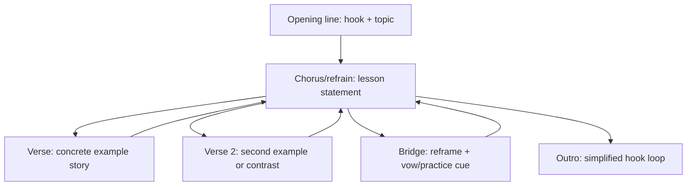

# Catchy and Viral Lyrics for Educational Spiritual Songs

## Executive summary
Catchiness in lyrics can be modelled as a blend of cognitive ease (processing fluency), structured repetition, and a standout hook that listeners can recall and reuse in social contexts. Research across pop lyrics, memory science, and worship-song scholarship converges on a practical pattern: early clarity plus repeatable phrasing drives recall, and recall amplifies platform signals like completion, replays, shares, saves, and skips. citeturn21view0turn10view5turn21view3turn15view1turn29view4turn11view1

For educational spiritual songs, an added constraint applies: lyrics must deliver teachable meaning while sustaining reverence and cultural sensitivity. Worship-song research emphasises balancing cognitive content (teaching, coherence) with emotive content (felt devotion), because songs shape belief and practice through repeated singing. citeturn29view0turn26view1

The most actionable predictors for likely views and likes are measurable and can be judged from text alone:
- A hook phrase that appears in the opening lines and reappears several times, with chorus-wise repetition that avoids extreme word-level looping. citeturn21view0turn10view5turn21view3
- High singability and intelligibility: conversational grammar, frequent words, clear stress patterns, and limited tongue-twisters, since lyrics that are hard to parse or sing reduce participation and reuse. citeturn21view6turn29view1turn21view2
- Moderate rhyme and meter craft (end rhymes plus selective internal rhyme) paired with stable line lengths, because rhyme and meter features help separate hits from flops in prediction models, yet worship and learning contexts also reward rhythmic consistency and clarity. citeturn25view2turn29view1
- Concrete imagery and micro-stories that anchor abstract spiritual ideas in everyday scenes, improving memorability and comprehension. citeturn21view7turn21view5turn21view4

Platform strategy modifies what “good lyrics” means:
- TikTok prioritises personalised ranking based on user interactions plus video information such as captions, sounds, and hashtags, with completion as a strong indicator. citeturn11view1
- YouTube’s systems learn from watch time and viewer satisfaction, and emphasise packaging (title plus thumbnail) and early hooks. citeturn10view2turn29view4turn10view1
- Spotify counts a stream after 30 seconds, and recommendations derive from a taste profile shaped by listening, skipping, and saving. citeturn10view3turn15view1turn15view2

A weighted scoring rubric and a judge prompt appear below, plus an A/B validation plan to calibrate predictions with audience data. citeturn15view2turn10view1turn11view1

## Evidence on catchiness, virality, and what listeners seek in lyrics

### Hooks and repetition as a memory engine
Across songwriting scholarship, a hook is a short musical or lyrical fragment that stands out and is easy to remember. Hooks often rely on recurrence. Recurrence can be delivered through section-level repetition (a returning chorus) rather than endless word-level looping. citeturn21view0turn10view5

Large-scale market evidence links chorus repetition to faster adoption and higher chart outcomes through processing fluency: repeated choruses make lyrics easier to process, which supports consumer choice and early uptake. At the same time, very high word repetition can cancel the benefit of chorus repetition, implying an optimal repetition band rather than a single loop. citeturn10view5

Time-series analyses of popular lyrics show a long-run move toward simpler, easier-to-comprehend language and shifts toward more personal, negative emotional language. These trends align with a broad preference for linguistic ease and direct self-reference, which can be harnessed in spiritual education by pairing vulnerability (“I struggle”) with guidance (“here is the practice”). citeturn21view3turn21view4

### Earworms, exposure, and sing-along mechanics
Earworms (involuntary musical imagery) are widespread, often involving a short repeating fragment. Reviews and surveys describe earworms as common, with many episodes experienced weekly; repetition and recent exposure are frequent triggers. citeturn23view2turn23view1

People often respond by seeking the tune or using competing musical or verbal material, suggesting that a short, repeatable lyrical fragment has high reactivation potential. For creators, this maps to a quotable line: a fragment suited for comments, captions, duets, and communal singing. citeturn23view2

### Educational spiritual songs as musical mnemonics
A systematic review across decades of studies on musical mnemonics (sung presentation of verbal information) finds beneficial effects on some aspect of memory in most included studies. It also highlights familiarity as a factor that can support mnemonic benefit. This supports a design goal for educational spiritual songs: embed a short, familiar-feeling refrain that encodes the core teaching. citeturn21view5turn21view4

A practical implication is that teaching content belongs in the chorus or refrain, because it receives the highest repetition. This also reduces cognitive load: listeners learn one central lesson thoroughly, then receive optional elaboration in verses. citeturn10view5turn21view5

### Worship, reverence, and the cognitive–emotive balance
Hymnology research argues that “good” Christian songs sustain communities when they balance cognitive value (truth claims, teachings, coherent content) with emotive value (heart-level resonance). This balance is presented as a bridge across worship-style divides and as a predictor of longevity in congregational repertoires. citeturn29view0turn26view1

Studies of contemporary congregational songs and their high-view live videos on YouTube observe that churches often keep original lyrics while reproducing performative cues from exemplar videos, implying that a lyric’s phrasing and theology can propagate widely once embedded in popular recordings. citeturn26view2

A cross-cultural viral case also illustrates spiritual uplift plus participatory framing: scholarship analysing spiritual aspects of a well-known dance challenge links its circulation to communal coping and spirituality during COVID-19 constraints, showing how a simple, repeatable lyrical frame can travel via participatory formats. citeturn26view3

### Mini-case analyses of viral educational spiritual songs
The goal here is pattern extraction rather than genre ranking. These cases show how repeatable lines, participatory framing, and clear spiritual functions (praise, lament, practice) interact with platform mechanics. citeturn11view1turn10view2turn15view1

**entity["song","Jerusalema","master kg 2019 song"]** travelled globally via a dance challenge during the COVID-19 period; academic analysis links its circulation to communal uplift and spirituality, illustrating how a spiritually framed refrain can become a social ritual. citeturn26view3turn5news44

**entity["song","Shree Hanuman Chalisa","t-series devotional video"]** demonstrates evergreen devotion: a long-form devotional video crossed 5 billion YouTube views by late 2025, showing that repeated daily-use spiritual texts can sustain massive volume over years when they fit real rituals and search behaviour. citeturn26view5

**entity["song","Your Way's Better","forrest frank 2024 song"]** (by entity["musical_artist","Forrest Frank","american christian singer"]) illustrates short-form crossover: reporting describes a TikTok dance trend that lifted the song into TikTok Top 50 visibility and supported mainstream chart presence, suggesting that a concise prayer-like chorus can be both teachable and meme-ready. citeturn6search0turn26view4

| Case | Core lyrical function | Reuse mechanism | Practical takeaway for educational spiritual songs |
|---|---|---|---|
| Jerusalema | Uplift plus belonging | Dance challenge frames group participation | Embed a single line that functions as a communal rally point |
| Shree Hanuman Chalisa | Devotional recitation | Daily ritual plus search plus long-term accumulation | Design choruses and refrains that align with repeatable practices |
| Your Way's Better | Personal prayer plus reassurance | Dance plus short chorus reuse | Keep the teachable line inside the part people repeat and share |

### Linguistic craft: rhyme, meter, frequency, clarity, imagery
Hit-prediction work using lyrics alone shows that rhyme, syllable, and meter features can separate hits from flops better than chance, and the authors report a consistent direction: greater rhyme or meter complexity correlates with higher likelihood of a hit in their setting. For this genre, this supports using craft elements, while still controlling for singability and clarity. citeturn24view0turn25view2

Lyric intelligibility research provides guardrails. Experiments indicate reduced intelligibility when lyrics use archaic language, when musical rhythm clashes with speech prosody, and when melismas dominate; repetition priming can support recognition, and word frequency plays a role. For educational spiritual content, intelligibility is a primary constraint, because the lesson must be heard and remembered. citeturn21view6turn29view1

Concreteness research on lyrics offers another lever: more concrete, imageable language gives listeners mental handles for recall. Trend work treats concreteness as a measurable stylistic dimension rather than intuition. citeturn21view7

image_group{"layout":"carousel","aspect_ratio":"1:1","query":["songwriting hook chorus lyric sheet","congregational singing hymn lyrics community"]}

## Evidence-backed measurable criteria and thresholds
This section lists measurable criteria you can extract from lyrics-only drafts. Some thresholds come directly from platforms (timing, counting rules). Others are operational heuristics: values chosen to match empirical directions (fluency, repetition) and practical constraints (singability, learning). citeturn10view3turn10view5turn29view1turn21view6

### Core lyrical criteria table
| Dimension | Metric you can measure from text | Target range for educational spiritual songs | Evidence basis |
|---|---:|---:|---|
| Hook presence | Hook line length (words) | 4–9 words | Short, memorable phrases are core to hook definitions and reuse. citeturn21view0 |
| Hook timing | First hook occurrence (line index) | ≤ line 2 for short-form snippet; ≤ line 4 for full lyric | Early hooks support retention decisions on video platforms; platform guidance highlights early seconds. citeturn29view4turn11view1 |
| Hook recurrence | Hook occurrences | ≥ 3 occurrences; distributed across sections | Recurrence supports processing fluency and recall; earworm literature emphasises repeating fragments. citeturn10view5turn23view2 |
| Section repetition | Chorus count | 3–5 choruses in full song | Chorus repetition predicts faster adoption with a ceiling for extreme word repetition. citeturn10view5 |
| Word repetition balance | Repeated-word share (rough estimate) | 15–35% | Very high word repetition can cancel chorus-repetition benefits; lyric simplicity trends favour moderate repetition. citeturn10view5turn21view3 |
| Rhyme density | End-rhyme coverage (lines ending in a rhyme family) | 30–70% | Rhyme and meter features help discriminate hits; internal rhyme varieties exist, yet clarity matters. citeturn25view2turn21view6 |
| Meter consistency | Syllables per line variation in chorus | SD ≈ 0–2 syllables (heuristic) | Congregational guidance stresses consistent syllable counts; meter features are predictive in hit models. citeturn29view1turn25view2 |
| Readability | Estimated reading level | Children: Grades 1–4; general: Grades 4–8 | Popular lyrics trend toward easier comprehension; musical mnemonics benefit from familiarity and ease. citeturn21view3turn21view5turn21view4 |
| Concreteness | Concrete image units per verse | ≥ 1 vivid scene or object per 2–4 lines | Concreteness supports lyric comprehension and mental imagery. citeturn21view7 |
| Educational clarity | Distinct lesson statement line | 1 clear thesis line in chorus; 1 short practice cue | Musical mnemonic literature supports sung encoding of key info; worship scholarship values cognitive content. citeturn21view5turn29view0 |
| Emotional valence | Emotion arc | Struggle → guidance → uplift (measurable by language cues) | Lyrics trend toward personal affect; worship scholarship stresses emotive–cognitive balance. citeturn21view3turn29view0 |
| Length planning | Shareable excerpt length | 15–30 seconds worth of lines (≈ 2–6 lines) | Earworm fragments tend to be short; short-form platforms rely on rapid retention decisions. citeturn23view2turn29view4turn11view1 |
| First 30 seconds rule | Chorus arrives before 30 seconds (music-level) | Aim for chorus or refrain before 0:30 | Spotify counts a stream after 30 seconds, incentivising early engagement. citeturn10view3 |

Song-length norms have shifted under streaming incentives. Spotify counts a stream once a listener reaches 30 seconds, and reporting on chart-era trends describes shorter mainstream song lengths and shorter intros, with earlier entry of vocals and choruses. For educational spiritual music, this supports two deliverables: a 15–30 second hook excerpt for short-form, and a full version around 2–3.5 minutes that reaches the refrain by about 0:30. citeturn10view3turn3search2turn27search22

### Structural element targets
A practical structural template for educational spiritual songs is verse–chorus form with a short refrain that carries the lesson, optional pre-chorus for tension, and a bridge that reframes the teaching in a fresh image or direct prayer. Sectional repetition drives learning, while a bridge can add novelty for sustained attention. citeturn10view5turn21view0turn29view0

### Music and lyric fit constraints
Even with lyrics-only evaluation, you can approximate music fit because rhythm, breathing, and register constraints leave textual fingerprints.

Phrasing and prosody: align stressed syllables with strong beats and keep line breaks at natural speech pauses. Congregational song analysis shows that stable rhythms can place stress consistently on key words, which supports both meaning and comfort. Experimental work also reports lower intelligibility when musical rhythm clashes with speech prosody. citeturn21view2turn21view6

Syllable density: faster tempi require fewer syllables per beat, so hook lines should use short words and regular stress. Earworm research and commentary often associates sticky songs with comparatively faster tempi plus familiar contours, which reinforces the value of concise hooks when you plan short-form excerpts. citeturn22search26turn23view1

Range and key: for communal singing, keep the melodic range within about an octave plus a step, and choose a key that sits comfortably for average voices. This choice shapes lyric feel indirectly: high keys push vowels toward strain, which reduces clarity and makes complex consonant clusters harder. citeturn29view1turn21view6

Melisma and clarity: aim for mostly one pitch per syllable in the main hook and teaching lines. Both worship guidance and intelligibility experiments indicate melismas reduce clarity for groups and reduce recognition of sung words. citeturn29view1turn21view6

## Platform strategy, audience factors, and metadata levers

### Platform mechanics that interact with lyrics
TikTok’s For You feed ranks content using user interactions plus video information like captions, sounds, and hashtags, and it treats full watch-through as a strong indicator of interest. This aligns with lyric design that yields early comprehension and a short, repeatable hook that people reuse as a sound. citeturn11view1

For music discovery, TikTok and entity["organization","Billboard","music charts publisher us"]’s Top 50 chart methodology explicitly combines creations (how many people make videos using the sound), video views, and engagement. That implies a target outcome for lyrics: a hook that motivates imitation. In spiritual education, imitation can be framed as practice: a line people repeat as an affirmation, prayer, or mantra. citeturn29view3turn27search0

YouTube’s recommender emphasises watch time and long-term viewer satisfaction, including survey-based measures of valued watch time. Official guidance also frames packaging (title plus thumbnail) and early hooks as decisive for whether viewers stay. citeturn10view2turn29view4turn10view1

Spotify’s ecosystem blends editorial curation with personalised algorithms that rely heavily on the listener’s taste profile, shaped by actions like listening, skipping, and saving. In practice, this means lyrics that reach a clear chorus before 30 seconds can reduce early skips while shaping saves and re-listens. citeturn15view1turn10view3turn15view2

### Platform comparison table
| Surface | Primary behavioural signals (high-level) | Lyric design implications | Metadata and publishing levers |
|---|---|---|---|
| TikTok | Interactions (likes, shares, comments, follows), video info (captions, sounds, hashtags), completion as strong indicator citeturn11view1 | Hook in the opening lines; 1–2 quote lines suited for on-screen text; simple pronunciation; high loop-ability | Caption uses topic keywords plus spiritual practice cue; a small, focused hashtag set; sound name includes hook phrase citeturn11view1 |
| YouTube (long-form plus Shorts) | Watch time and satisfaction; early hook; packaging drives click behaviour; absolute vs relative watch time differ by length citeturn10view2turn10view1turn29view4 | Title phrase appears early in lyrics; chorus before 0:30; clarity for subtitles; avoid dense internal rhymes that blur consonants | Title plus thumbnail communicate promise; description supplies searchable context; tags play a low role and mainly cover misspellings citeturn29view4turn28search0 |
| Spotify | Stream counted at ≥30 sec; recommendations from taste profile (listens, skips, saves); algorithmic plus editorial inputs citeturn10view3turn15view1turn15view3 | Chorus or refrain before 0:30; hook phrase works as track title; repetition balanced to invite replay | Accurate genre and mood metadata; lyric upload for in-app lyrics; playlist pitching and consistent release framing citeturn15view1turn15view3 |
| Instagram Reels | Public guidance is mainly via creator commentary; third-party summaries cite watch time, likes per reach, and shares/sends as key signals; recommendations emphasise hooks and originality citeturn27search5turn27search13turn27search17 | Hook as on-screen caption in first seconds; chorus line that invites sending to friends; reduce wordiness per line | Cover text mirrors hook; caption includes keywords; lean hashtag set; cross-post with watermark removal citeturn27search5turn12search24 |

### Audience factors for educational spiritual songs
Because audience composition varies by account, niche, and region, the most reliable demographic guide is your own platform analytics. Use that to set reading level and vocabulary: younger audiences benefit from shorter words and concrete examples; more theologically literate audiences tolerate denser references. citeturn29view4turn15view1

The genre also carries a community-use pattern. Congregational traditions favour singability: limited range, mostly syllabic settings, stable rhythms, and consistent syllable counts across verses. Even for solo listening, these properties increase sing-along participation, which increases reuse and sharing. citeturn29view1turn21view2

### Cultural and religious sensitivity checklist
Educational spiritual songs can travel across traditions, so sensitivity is both ethical and strategic: a song perceived as disrespectful can lose recommendation eligibility or audience trust.

Key measurable checks:
- Sacred terms: use tradition-appropriate context; avoid mixing incompatible ritual phrases in a single refrain unless the song’s purpose is explicitly interfaith education. citeturn29view0turn26view1
- Attribution: if lyrics paraphrase scripture, keep meaning intact and cite references in video descriptions for transparency and education. citeturn29view0turn29view4
- Avoid caricature: avoid stereotypes, mockery, or exploitative use of grief or sacred space for humour; memeability can coexist with reverence when the hook is practice-oriented. citeturn26view2turn23view2

## Judge prompt and weighted scoring rubric

### Evidence-backed rubric overview
This rubric scores a lyric draft for predicted engagement potential using weighted subscores. It assumes the melody is unknown, so it relies on text proxies for singability, phrasing, and hook placement. It also includes gating checks for spiritual education quality and cultural safety. citeturn21view0turn10view5turn21view6turn29view0

Weights are chosen to align with repetition and hook effects on adoption, intelligibility constraints, and platform retention signals that dominate distribution. citeturn10view5turn10view2turn11view1turn15view1

| Category | Weight | What to score (0–10) | Scoring anchors |
|---|---:|---|---|
| Hook strength and timing | 20 | Hook clarity, brevity, early placement, recurrence | 0: hook absent; 5: hook present yet late; 10: hook in first 2–4 lines and returns ≥3 times citeturn21view0turn29view4 |
| Repetition design | 12 | Chorus repetition plus controlled word repetition | 0: diffuse message; 10: chorus repeats, word looping restrained citeturn10view5 |
| Singability and intelligibility | 12 | Easy pronunciation, stable line lengths, speech-like rhythm | 0: tongue-twisters or archaic; 10: clear, syllabic phrasing citeturn21view6turn29view1 |
| Rhyme and meter craft | 10 | End rhyme plus selective internal rhyme; meter consistency | 0: prose-like; 10: rhyme structure with steady syllables citeturn25view2turn29view1 |
| Imagery and concreteness | 8 | Concrete scenes anchoring spiritual ideas | 0: abstract only; 10: vivid, teachable images citeturn21view7 |
| Emotional resonance | 10 | Authentic affect arc; struggle → guidance → uplift | 0: flat; 10: clear emotional movement citeturn21view3turn29view0 |
| Educational payload | 10 | One clear lesson statement plus practice cue | 0: vague spirituality; 10: crisp, teachable core citeturn21view5turn29view0 |
| Spiritual authenticity and sensitivity | 10 | Respectful tone, coherence within a tradition or clear interfaith framing | 0: disrespect risk; 10: reverent, accurate framing citeturn29view0turn26view2 |
| Platform packaging readiness | 8 | Title phrase, excerptability, caption-friendly lines | 0: hard to package; 10: strong title, 15–30 sec excerpt, shareable quote lines citeturn29view4turn11view1turn10view3 |

Total score = sum(weight × score/10), max 100.

### Judge prompt
You can copy and paste the prompt below as a judge instruction for ranking generated songs.

**Prompt (copy and paste):**

You are an expert evaluator of lyrical virality and learning value for educational spiritual songs. Score the provided lyrics using the rubric below. Assume melody, tempo, and key are unknown. Focus on text features that predict recall, sing-along participation, and short-form excerptability.

Return:
1) A table with each category score (0–10), weighted contribution, and a one-sentence justification.
2) A short hit risk profile with three strengths and three liabilities.
3) Three hook candidates (each 4–9 words) extracted or rewritten from the lyrics, plus the best 15–30 second excerpt (2–6 lines) for short-form.
4) A final overall score 0–100 and a verdict label: high, medium, or low predicted engagement.

Rubric (0–10 each, then weight):
- Hook strength and timing (20)
- Repetition design (12)
- Singability and intelligibility (12)
- Rhyme and meter craft (10)
- Imagery and concreteness (8)
- Emotional resonance (10)
- Educational payload (10)
- Spiritual authenticity and sensitivity (10)
- Platform packaging readiness (8)

Gating checks: If lyrics include disrespectful treatment of a faith group or encourage harm, set overall verdict to low and explain.

### Visual examples of effective hook patterns
These are schematic templates you can aim for. Replace brackets with your content.

1) **Practice mantra (affirmation hook)**  
[Hook] “Breathe in peace, breathe out love”  
[Echo] “Breathe in peace, breathe out love”  
[Lesson] “Slow the mind, soften the heart”

2) **Call–response (community hook)**  
[Call] “When fear speaks, what do we do?”  
[Response] “We pray, we breathe, we start again”

3) **Concrete metaphor (image hook)**  
[Hook] “Light the lamp, then share the flame”  
[Lesson] “One small act can change a room”

## Worked examples and validation plan

### Three anonymised sample lyrics
These samples are short on purpose to mimic excerpt-first discovery flows common on short-form platforms. citeturn11view1turn29view4

**Sample A (strong)**  
1. Breathe in peace, breathe out love  
2. Breathe in peace, breathe out love  
3. When worry comes, I count to four  
4. I feel my feet upon the floor  
5. Breathe in peace, breathe out love  
6. I speak forgiveness, let it go  
7. Like rain that rinses dusty roads  
8. I bless the stranger, bless my friend  
9. Breathe in peace, breathe out love  
10. Repeat the practice, start again  

**Sample B (medium)**  
1. I walk toward light, I walk toward grace  
2. My heart is learning its own place  
3. The path is long, the day is wide  
4. I keep my hope, I keep my guide  
5. I walk toward light, I walk toward grace  
6. Teach me patience, teach me calm  
7. Teach me how to mean no harm  

**Sample C (weak)**  
1. Transcendent essence of the divine  
2. In metaphysical design  
3. We contemplate the sacred core  
4. And then we contemplate some more  
5. The cosmic absolute is true  
6. And that is what we always do  

### Scoring application
| Sample | Overall (0–100) | Why it lands there (summary) |
|---|---:|---|
| A | 88 | Hook is short and repeated early; concrete actions; clear practice cue; high excerptability |
| B | 70 | Strong end rhyme and meaning; hook repeats, yet fewer concrete images and weaker how-to |
| C | 38 | Abstract diction; weak singability; low concreteness; limited hook recurrence |

Breakdown (category scores 0–10):

| Category | A | B | C |
|---|---:|---:|---:|
| Hook strength and timing | 10 | 7 | 2 |
| Repetition design | 9 | 6 | 2 |
| Singability and intelligibility | 9 | 7 | 3 |
| Rhyme and meter craft | 7 | 8 | 6 |
| Imagery and concreteness | 8 | 4 | 1 |
| Emotional resonance | 8 | 7 | 3 |
| Educational payload | 9 | 5 | 1 |
| Spiritual authenticity and sensitivity | 9 | 9 | 7 |
| Platform packaging readiness | 10 | 7 | 3 |

These scores operationalise evidence that repetition and hooks drive adoption, and that intelligibility and familiarity support both learning and participation. citeturn10view5turn21view6turn21view5turn29view1

### Suggested A/B tests and success metrics
Predictions about virality remain probabilistic because distribution depends on recommender systems and social copying dynamics. Treat the rubric as a hypothesis generator, then calibrate with controlled experiments. citeturn14search30turn10view2turn11view1turn15view2

A/B test design principles:
- Hold music, visual style, and posting time constant; vary one lyric factor at a time (hook wording, repetition density, concreteness, lesson clarity). citeturn15view2turn10view1
- Use multiple creatives per condition to reduce single-post luck.
- Track both early signals (first-hour retention) and longer-tail signals (saves, shares, replays, playlist adds).

Metrics by platform:
- TikTok: 5-second retention proxy (qualified views concept), completion rate, shares, saves, creations using your sound. citeturn19search0turn11view1turn29view3
- YouTube: click-through rate via title and thumbnail, absolute and relative watch time, audience retention curve inflection points, satisfaction proxy via repeat viewing and comments quality. citeturn10view1turn29view4turn10view2
- Spotify: skip rate before 0:30, saves, playlist adds, repeat listens; monitor algorithmic growth via personalised surfaces. citeturn10view3turn15view1turn15view2
- Instagram Reels: watch time and shares or sends (use platform insights), plus follower-to-non-follower reach split. citeturn27search13turn27search17turn27search5

