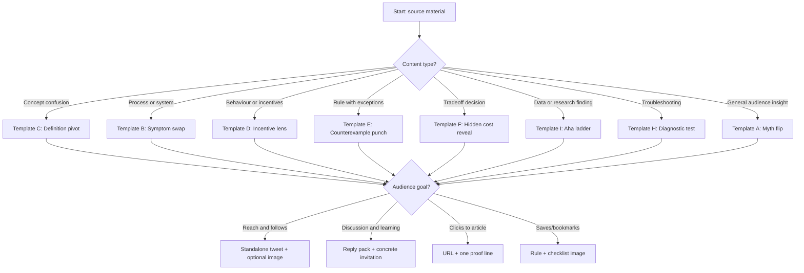

# Evergreen tweet refinery for compressing an article into one idea

## Executive summary

Evergreen traction on entity["company","X","social media platform"] tends to come from posts that deliver a fast cognitive upgrade: a clear problem frame, a hidden driver, then an insight that changes what a reader would do next. This aligns with controlled evidence that people share information when it helps the receiver act, feel, or understand, and that these weights vary by person yet stay stable within individuals. citeturn20view0

A perennial template also has to fit platform distribution physics. X’s recommendation system ranks from a large candidate set using a neural model trained on interaction signals (likes, reposts, replies), then applies heuristics such as social proof and feedback-based fatigue. citeturn16view0 Meanwhile, attention decays quickly: view-count analyses estimate a median tweet half-life near 80 minutes and show that most impressions accrue within a day, with an early peak in the first couple of minutes. citeturn27view0turn25view2

Across the strongest primary research on sharing, three mechanisms repeatedly support durable engagement: high-arousal emotion (especially awe and curiosity), processing fluency (easy reading), and identity fit (people share content that supports self-image and community positioning). citeturn5view0turn13search2turn8view1turn11search2turn25view0turn5view4

In practice, the most perennial “Problem → Hidden cause → Insight” families are anchored in stable mechanisms rather than topical events: definition pivots, incentive lenses, constraint levers, and diagnostics. They age slowly because they keep yielding action and understanding, and they are easier to refresh via new examples, angles, and visuals, reducing template wear-out. citeturn5view8turn31view1turn16view0turn15view0

## Evidence base for evergreen traction and novelty decay

High-arousal emotion increases transmission. In a large analysis of “most-emailed” entity["organization","The New York Times","newspaper new york"] articles, entity["people","Jonah Berger","marketing professor"] and entity["people","Katherine Milkman","behavioural scientist"] find that content evoking awe, anger, or anxiety spreads more, while low-arousal sadness spreads less. citeturn5view0 Large Twitter-context studies also find emotionally charged messages are retweeted more and faster than neutral ones. citeturn13search2

Curiosity remains durable because it is triggered by a perceived knowledge gap: attention focuses on what the reader lacks, and a small amount of new information can intensify the desire to learn more. citeturn7view0turn7view1 This maps naturally to compression posts: a crisp problem statement and incomplete explanation creates tension, then the hidden cause resolves it with insight. citeturn20view0

Fluency is a second evergreen driver. Cognitive fluency of headlines predicts sharing across large samples, suggesting fluency can act as a gate before diffusion. citeturn8view1 Social media research also finds easier-to-read posts generate more engagement, consistent with processing-fluency theory. citeturn11search2turn12view0

Identity and self-presentation shape amplification. A foundational retweeting study links what people retweet to self-image, community building, and conversational participation. citeturn25view0 More recent work using panel data finds users retweet familiar topics to maintain a consistent public identity. citeturn5view4 For evergreen writing, this implies that stable audience interests can keep the same core insight valuable across long spans, as long as the packaging rotates. citeturn19view0

Novelty helps, yet novelty-as-a-strategy decays. Diffusion research shows false news spreads farther and faster than true news on Twitter, with novelty and surprise implicated as drivers. citeturn2search1turn2search5 Separate work on beliefs and novelty finds that sharing is also driven by belief consistency, meaning semantic fit can matter as much as surprise. citeturn19view0 For long-run perceived value, evergreen templates work best when they generate “aha” insight without over-claiming or bait dynamics that erode trust. citeturn28view1turn20view0

Wear-out is real. Repeated exposure can reduce engagement by lowering valuation-related neural activity, which relates to attention and elaboration. citeturn5view8 Information overload and message fatigue can reduce elaboration and motivation in high-volume information environments. citeturn31view1turn31view0 X’s ranking and policy ecosystem reinforces this: the platform applies feedback-based fatigue in feed construction and has explicit anti-spam rules that cover duplicative content and engagement spam. citeturn16view0turn15view0

Practitioner playbooks from entity["organization","Ship 30 for 30","online writing course"], entity["people","Justin Welsh","content creator"], and entity["people","Kieran Drew","writer and creator"] converge on similar principles: hooks that land in seconds, “insight” as the emotional payload, and template systems that preserve value while varying angle and example. citeturn29view0turn29view1turn29view2

## The refinery system for tweets, replies, and short video summaries

This refinery converts any long piece into three reusable outputs: one standalone tweet, a reply pack, and a short video script. It is designed around (a) sharing motives (action, affect, cognition), (b) fluency, and (c) rapid attention decay. citeturn20view0turn8view1turn27view0

**Inputs and constraints.** Standard posts cap at 280 characters and allow up to 4 media items, while longer posts up to 25,000 characters require Premium. citeturn23view0turn23view1turn23view2 Replies and @-mentions have different visibility behaviour than standalone posts, which matters for discovery. citeturn23view1

**Compression pipeline.**  
Step one: write the three-line spine (Problem, Hidden cause, Insight), each as a single sentence in plain language. citeturn20view0  
Step two: choose a template family (A–J) based on content type and audience goal (flowchart below).  
Step three: add one proof element: a micro-example, a small number, a vivid analogy, or a simple visual. In large-scale Twitter analytics, URLs and hashtags correlate with retweet probability, yet excessive templating and spam patterns carry risk. citeturn21view0turn21view1turn15view0  
Step four: ship as a pack: one tweet containing the full compression, then replies that add one example, one boundary, and one focused question that elicits specific stories rather than generic agreement. This harnesses conversation value without straying into engagement spam territory. citeturn25view0turn15view0

**Visual and formatting options.** Simple visuals can lift engagement. Twitter’s own reported component study found photos and videos associated with higher retweets, and research on graphical or visual abstracts explores similar amplification dynamics in scholarly contexts. citeturn14search10turn14search12 Visual-design research also links higher processing fluency (symmetry, high contrast) to stronger engagement on social images. citeturn10view2

image_group{"layout":"carousel","aspect_ratio":"16:9","query":["tweet mockup template minimalist","x post infographic example","visual abstract twitter example"],"num_per_query":1}

## Template families with examples and refresh rules

Each template below includes structure, ideal length, tone, emotional triggers, hook types, best-fit topics, 2–3 neutral examples, plus a longevity risk reading and refresh rules. The families are designed to work with arousal-driven sharing, fluency constraints, identity motives, and wear-out dynamics. citeturn5view0turn8view1turn25view0turn5view8turn31view1

**Template A: Myth flip (common belief → hidden mechanism → new lever)**  
Ideal length: 180–260 characters. Tone: crisp, confident. Triggers: surprise + insight. Hook: “Most people think…”. Best fit: habits, productivity, everyday economics.  
Examples:  
> Most people blame meetings for slow execution.  
> Hidden driver: unclear ownership.  
> One named owner per decision cuts cycle time fast.

> People assume meal prep fails from willpower.  
> Hidden driver: friction at 5 p.m.  
> Pre-chop one ingredient and lower the start cost.

> People assume price hikes come from greed.  
> Hidden driver: unstable inputs.  
> A steadier supplier beats a harder negotiation.

Longevity: high through identity and generality. citeturn5view4turn25view0 Decay risk: medium if openings repeat. Refresh: rotate the first line (“common advice”, “popular story”), swap cause class (incentive, constraint, habit), add one micro-example reply, and vary format (2 lines vs 4 lines). Avoid near-duplicate reposting patterns. Placement: use as a standalone tweet for reach, then place proof in the first reply and a boundary in the second reply. citeturn15view0turn16view0turn5view8

**Template B: Symptom swap (pain → root constraint → smallest lever)**  
Ideal length: 160–240. Tone: practical. Triggers: relief + control. Hook: “If you keep seeing X…”. Best fit: operations, training, personal finance.  
Examples:  
> If workouts stall, it looks like effort.  
> Root constraint: recovery bandwidth.  
> Add 30 minutes of sleep before adding 2 kg to the bar.

> If an inbox stays huge, it looks like volume.  
> Root constraint: missing filters.  
> A “reply today / archive” rule changes the system.

> If a team ships late, it looks like speed.  
> Root constraint: dependency queues.  
> Freeze scope at 80% and ship the core.

Longevity: very high, because constraints recur. citeturn20view0turn31view1 Decay risk: low. Refresh: rotate constraint types (time, attention, energy), and attach a simple before/after diagram. Placement: use as a standalone tweet, then add one concrete example as a reply for extra fluency and trust. citeturn10view2turn8view1

**Template C: Definition pivot (term mismatch → hidden meaning → decision implication)**  
Ideal length: 170–250. Tone: teacherly. Triggers: clarity + insight. Hook: “X is a misleading label.” Best fit: mental models, business terms, health terms.  
Examples:  
> “Motivation” is a misleading label.  
> Often it is energy management.  
> Fix sleep, light, and meals, and motivation shows up as a side effect.

> “Time management” is a misleading label.  
> It is priority defence.  
> Pick 2 outcomes for the week, then defer the rest.

> “Productivity” is a misleading label.  
> It is throughput of the bottleneck.  
> Protect your first 90 minutes, then let the rest flex.

Longevity: very high; definition posts travel well as identity markers. citeturn25view0turn5view4 Decay risk: medium. Refresh: swap framing (“category error”, “wrong unit”), add a boundary reply, and keep sentences short for fluency. Placement: use as a standalone tweet when you want reach, or as a quote-post when responding to a messy definition in the wild. citeturn8view1turn5view8

**Template D: Incentive lens (surface story → incentive → predictable outcome → intervention)**  
Ideal length: 190–270. Tone: analytical. Triggers: “aha”, status signalling. Hook: “The behaviour makes sense once you see…”. Best fit: markets, workplace behaviour, social dynamics.  
Examples:  
> Subscription churn looks like customer indecision.  
> Incentive issue: value appears after week 2.  
> Make day 1 deliver one clear win.

> Late replies look like rudeness.  
> Incentive issue: high volume with zero triage.  
> A shared SLA plus templates beats guilt.

> Overbuying gadgets looks like impulsiveness.  
> Incentive: identity reinforcement.  
> Tie buying to a 7-day use plan.

Longevity: high across domains. citeturn20view0turn5view4 Decay risk: medium. Refresh: rotate incentive types (risk, status, time), add a falsifiable prediction, and attach a tiny checklist image. Placement: use as a quote-post on a real example, or post standalone with a small prediction and follow-up reply. citeturn10view2turn16view0

**Template E: Counterexample punch (rule → exception → hidden variable → updated rule)**  
Ideal length: 170–240. Tone: curious. Triggers: surprise + curiosity gap. Hook: “This rule fails when…”. Best fit: learning, fitness, skill-building.  
Examples:  
> “Practice makes perfect” fails for skills with fast feedback.  
> Hidden variable: error visibility.  
> Updated rule: practise with tight feedback loops.

> “Eat less” fails for people with strong snack triggers.  
> Hidden variable: environment.  
> Updated rule: change what is within arm’s reach.

> “Write daily” fails for chaotic schedules.  
> Hidden variable: rhythm.  
> Updated rule: protect 3 sessions a week and capture ideas daily.

Longevity: high when the updated rule generalizes. citeturn20view0turn8view1 Decay risk: higher if counterexamples feel forced. Refresh: alternate domains, add a second example in a reply, and avoid exaggeration because novelty can also amplify falsehood. Placement: use as a standalone tweet, then add a second counterexample in a reply to deepen credibility. citeturn2search1turn31view1

**Template F: Hidden cost reveal (benefit → unseen cost → threshold → decision rule)**  
Ideal length: 180–260. Tone: balanced. Triggers: relief + prudence. Hook: “The part people miss…”. Best fit: tools, habits, career decisions.  
Examples:  
> “Automate it” sounds efficient.  
> Hidden cost: maintenance and edge cases.  
> Automate after 10 repeats with stable steps.

> “Say yes to every opportunity” sounds brave.  
> Hidden cost: attention fragmentation.  
> Say yes when it moves your top metric this quarter.

> “Buy in bulk” sounds cheaper.  
> Hidden cost: waste and storage.  
> Bulk-buy only staples you already finish monthly.

Longevity: very high; tradeoffs stay universal. citeturn31view1turn5view8 Decay risk: low. Refresh: vary threshold, post a two-column image (benefit vs cost), and add the boundary as the first reply. Placement: use as a standalone tweet with a visual two-column image, then add the threshold and boundary in replies. citeturn10view2turn16view0

**Template G: Two-level model (micro cause → macro structure → actionable lever)**  
Ideal length: 200–280. Tone: explanatory. Triggers: awe from “seeing the system”. Hook: “At the personal level… at the system level…”. Best fit: behaviour change, team systems, education.  
Examples:  
> Personal level: people procrastinate because tasks feel heavy.  
> System level: the start step is ambiguous.  
> Lever: define a 2-minute start ritual.

> Personal level: budgets break from “small treats”.  
> System level: defaults are spending-first.  
> Lever: auto-transfer savings on payday.

> Personal level: flossing feels optional.  
> System level: feedback arrives late.  
> Lever: put floss beside the brush and track weekly.

Longevity: high, especially for human problems. citeturn20view0turn31view1 Decay risk: medium. Refresh: invert order (system first), replace “personal/system” with “local/global”, and keep lines short for fluency. Placement: use as a standalone tweet when you can fit it cleanly, or split micro and macro into tweet plus first reply. citeturn8view1

**Template H: Diagnostic test (symptom → 3 causes → quick test → next step)**  
Ideal length: 200–280. Tone: helpful. Triggers: usefulness and control. Hook: “Quick test: …”. Best fit: coaching, debugging, troubleshooting.  
Examples:  
> If you feel “busy” all day, likely causes:  
> (1) tasks too small, (2) context switching, (3) unclear priorities.  
> Quick test: track switches for 30 minutes. Then batch the top two.

> If runs feel harder lately, likely causes: heat, sleep debt, fuel timing.  
> Quick test: compare two easy runs with a 90-minute meal window.  
> Then lock one variable for a week.

> If an app keeps crashing, likely causes: memory leak, race condition, API retry storm.  
> Quick test: reproduce with logs on and one feature flag off.  
> Then isolate the smallest failing path.

Longevity: very high for niche audiences. citeturn5view4turn20view0 Decay risk: low. Refresh: rotate tests (timer, checklist, A/B) and attach a screenshot of the diagnostic output with alt text when possible. Placement: use as a reply when someone describes the symptom, or post standalone for a niche audience that loves checklists. citeturn14search9turn15view0

**Template I: Aha ladder (surface fact → inference → mechanism → takeaway)**  
Ideal length: 190–270. Tone: insightful. Triggers: awe and surprise. Hook: “This surprised me: …”. Best fit: research summaries, simple science, everyday data.  
Examples:  
> This surprised me: cheap tools cost more time than money.  
> Inference: friction is the real price.  
> Mechanism: repeated micro-delays.  
> Takeaway: price your time, then pick the tool.

> This surprised me: people remember single sentences more than full books.  
> Mechanism: insight compresses attention.  
> Takeaway: write one line worth repeating per page.

> This surprised me: small constraints can build capacity, chronic ones break it.  
> Mechanism: adaptation vs overload.  
> Takeaway: keep stressors small and time-boxed.

Longevity: medium-high when “surprise” comes from stable mechanisms. citeturn5view8turn31view1 Decay risk: higher if the opener repeats. Refresh: swap the opener, add a concrete boundary, and use a tiny visual that shows the relationship. Placement: use as a standalone tweet with a link or visual proof idea, then add the mechanism as the first reply. citeturn10view2turn5view0

**Template J: Crowd-proof compression (problem → cause → rule sentence → specific invitation)**  
Ideal length: 210–280. Tone: grounded. Triggers: affiliation and identity. Hook: “If you have seen X, try Y.” Best fit: professional niches, life skills, creator learning.  
Examples:  
> People struggle to keep journalling.  
> Hidden cause: the blank page feels like judgement.  
> Rule: start with 3 bullets only.  
> Invitation: share one 3-bullet prompt that keeps you consistent.

> Teams struggle with feedback.  
> Hidden cause: feedback arrives as evaluation.  
> Rule: ask for “one specific change for next week”.  
> Invitation: what phrasing gets you useful feedback?

> Learners struggle with vocabulary.  
> Hidden cause: exposure lacks retrieval.  
> Rule: use 10 words in 10 sentences.  
> Invitation: which daily topic could host those sentences?

Longevity: high when invitations demand concrete answers, since it supports conversation without engagement spam. citeturn25view0turn15view0 Decay risk: medium if invitations become generic. Refresh: vary the invitation type (example, tool, counterexample), keep it narrow (“one phrase”), and follow up by replying to a few high-quality answers. Placement: use when you want discussion, keep the invitation concrete, and reply to a few high-quality answers. citeturn25view0turn16view0

## Decision tools and performance tradeoffs

**Decision flowchart for selecting a template**



This flow reflects two constraints: engagement-based ranking optimizes predicted interactions and applies fatigue logic, and information value decays quickly in early hours. citeturn16view0turn27view0turn25view2

**Comparison table of tradeoffs**

| Template | Clarity | Virality potential | Longevity | Ease of automation |
|---|---|---|---|---|
| A Myth flip | High | High | High | High |
| B Symptom swap | High | Medium | Very high | High |
| C Definition pivot | High | Medium | Very high | Medium |
| D Incentive lens | Medium | Medium-high | High | Medium |
| E Counterexample punch | Medium-high | High | High | Medium |
| F Hidden cost reveal | High | Medium | Very high | High |
| G Two-level model | Medium | Medium | High | Medium-low |
| H Diagnostic test | High | Medium | Very high | Medium |
| I Aha ladder | Medium | High | Medium-high | Medium |
| J Crowd-proof compression | High | Medium-high | High | High |

Ratings reflect the evidence base: arousal supports sharing, fluency supports engagement, identity drives amplification, and wear-out increases with repetition. citeturn5view0turn8view1turn25view0turn5view8turn31view1

## Automation prompts and safety rails

The prompts below form a reusable refinery: distillation, template choice, generation, variation, and packaging. They aim to preserve fluency and value while reducing wear-out risk. citeturn8view1turn5view8turn31view1

**Prompt for distillation into Problem → Hidden cause → Insight**

```text
Role: senior editor for short-form insight posts.

Input:
- Article text or bullet points.

Output:
1) Problem (<=18 words): what frustration or confusion the reader feels.
2) Hidden cause (<=18 words): incentive, constraint, habit, or bottleneck.
3) Insight (<=18 words): a lever, rule, or reframe that changes choices.
4) Proof hook (<=20 words): micro example, small number, vivid analogy, or visual idea.
5) Boundary (<=20 words): when the insight fails.

Style:
- Plain language, short sentences.
- One idea per line.
- Avoid hype, avoid insults, avoid certainty beyond the data.
```

**Prompt for template choice plus tweet, replies, and video script**

```text
Role: content engineer for X.

Inputs:
- Problem / Hidden cause / Insight / Proof hook / Boundary
- Audience goal: reach | discussion | clicks | saves
- Topic domain and audience sophistication: general | niche expert

Task:
- Choose 1 template family (A–J) and justify in 2 lines.
- Draft:
  a) One standalone tweet (<=280 characters).
  b) A reply pack of 3 replies (each <=220 characters) that adds:
     - one example
     - one boundary condition
     - one specific question asking for a concrete story
  c) A 20–35 second video script:
     - Hook (1 sentence)
     - Problem (1 sentence)
     - Hidden cause (1 sentence)
     - Insight + action (2 sentences)
     - Closing line (1 sentence)
- Add a character count for each tweet.
```

**Prompt for a variation engine**

```text
Role: variation engine.

Input:
- One base tweet.
- Template family label (A–J).

Output:
- 12 variations grouped into 4 buckets (3 each):
  1) Hook swaps: curiosity gap, counterexample, definition pivot.
  2) Cause swaps: incentive, constraint, habit, environment.
  3) Format swaps: 2 lines, 3 lines, mini list, mini rule.
  4) Proof swaps: analogy, tiny stat placeholder, micro story.

Constraints:
- Preserve meaning and factual claims.
- Keep fluency high and jargon low.
- Avoid repeating the same opener across variations.
- Avoid generic engagement bait.
```

**Prompt for evaluation and accuracy risk**

```text
Role: evaluator.

Input:
- 6 candidate tweets.
- Source claim list (facts, numbers, boundaries).

Score each tweet 1–10 on:
- Fluency and clarity
- Useful insight (action or cognition)
- Emotional pull (curiosity or awe, low hostility)
- Specificity and proof
- Low wear-out risk (fresh phrasing)
- Accuracy risk (overclaiming, missing context)

Return:
- Top 1 tweet
- Two edits that reduce overclaiming
- A checklist of which claims require sources in the long-form piece
```

These prompts align with evidence that receivers weigh usefulness, affect, and uncertainty, and that novelty can amplify diffusion even for falsehood, making accuracy and boundaries crucial for long-run trust. citeturn20view0turn2search1turn31view1turn5view8

## Measurement and iteration for long-run value

Given rapid decay, evaluate in short windows (first 1–3 hours) and again at 24 hours. View-based studies estimate a median tweet half-life around 80 minutes and find most impression accrual happens within a day, while retweeting dynamics work finds much diffusion completes within 24 hours for many tweets. citeturn27view0turn25view2

Track three metric groups: (1) reach and engagement (views, likes, reposts, replies), (2) value signals (bookmarks, link clicks, profile visits), and (3) conversation quality (reply depth and specificity). These map cleanly to engagement-optimizing ranking models that predict multiple interaction labels. citeturn16view0turn28view1

To keep perceived evergreen value high, reuse the core insight while rotating packaging: change the example domain, swap the proof hook, or add a small visual. Avoid duplicative and coordinated engagement tactics, since X policy prohibits engagement spam and duplicative content spam, and algorithmic logic includes fatigue handling. citeturn15view0turn16view0turn5view8

Finally, favour mechanics that compound trust. Templates that offer diagnostics (H) and invite concrete stories (J) build community conversation, echoing research describing retweeting as a conversational infrastructure tied to identity and participation. citeturn25view0turn5view4