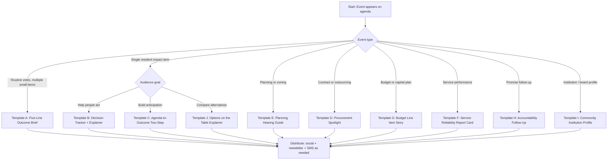

# Building a Distributist Local News Network for Municipal and County Life

## Executive summary

A successful local news network that covers council meetings, planning hearings, boards, and routine public services wins by turning “mundane” governance into **useful civic guidance**, **trustworthy records**, and **repeatable coverage rituals** that fit how people actually consume news today. Research on local news audiences and engagement shows three durable levers: (a) **community connection** as a structural advantage, cultivated through relevance and direct relationships (newsletters, messaging, events); (b) **clear, readable packaging** (simple headlines, layered summaries, action-focused explainers) that performs well in attention-scarce feeds; and (c) **visible trust signals** (transparency, “why this story,” corrections, sourcing) that materially improve audience evaluations and intent to return. citeturn7view2turn19view0turn21view0turn8view0turn23view2

A distributist editorial bias can coexist with credibility when it is built into an explicit, disciplined architecture: **fact-first reporting + clearly labelled analysis + separated opinion**, plus consistent disclosures about values, evidence standards, and corrective mechanisms. Survey work on local news attitudes suggests many people still want local journalists to remain neutral, yet a substantial minority supports a more active role, so the safest route is to keep “advocacy energy” in labelled formats and preserve a robust straight-news lane for meeting outcomes and public-record reporting. citeturn31view1turn8view0turn4view10

Because many people share links on social platforms without opening them, “headline + lede + bullet summary” often becomes the core product, even when a full article exists. That reality makes structured templates and a newsroom “refinery” essential: you can publish fast briefings immediately after meetings while producing deeper follow-ups that answer “why it matters” and “what residents can do next.” citeturn17view1turn19view0turn12view2

Assumptions used here: no specific city; English (en-CA); flexible budget and staffing; legal notes focus on common Canadian patterns with province-level variation (open meetings, access laws). citeturn4view7turn4view9turn4view8

## Evidence base for what makes local civic news succeed

Local news engagement tracks community attachment and civic connection. Survey research finds people with stronger community attachment follow local news more closely, use more sources, and rate local media more positively. citeturn31view0turn31view2 This matters for a “municipal mundanity” newsroom because your reporting can actively increase attachment by making residents feel oriented, capable, and included, especially around decision points like budgets, zoning, and service delivery. citeturn23view2turn22search24

A recurring engagement problem is dissatisfaction with local government coverage quality: a large share of adults consume local political and government news, yet only a minority report high satisfaction with it. That gap is an opportunity for a network that specialises in council and operational governance, as long as the output is digestible, consistent, and action-oriented. citeturn31view2

### Packaging and readability

Field experiments on real-world news publishing show that **simpler wording and more readable style correlate with higher click-through**. In these experiments, “more common words” and a “simpler linguistic style” aligned with higher CTR. citeturn19view0 Complementary work on social posts shows readability predicts more likes, comments, and shares, consistent with processing-fluency effects. citeturn21view0 For municipal reporting, this supports a style that avoids jargon (or explains it in-line), uses short sentences, and offers layered depth: skim-first summary with optional detail.

A second structural constraint is the “headline-only” problem: analysis of tens of millions of news-link posts on Facebook found most shares occurred without the sharer clicking through to read the article. citeturn17view1 This pushes local outlets toward producing high-value “front matter” that stands alone: title, lede, and a small set of verified facts.

### Trust, transparency, and engaged journalism

Transparency signals can measurably improve trust. Experimental research on Trust Indicators found that indicators increased evaluations of the news organisation and reporter, and increased intentions to seek more news and talk with others about the article. citeturn8view0turn4view10

Engaged journalism also shows causal benefits. A study with 20 local news sites randomly assigned to run a six-month engaged journalism initiative found the initiative increased subscriptions and improved audience evaluations, using both traffic/subscription data and audience surveys. citeturn23view2 This supports building structured “community questions” pipelines into the municipal beat.

### Distribution strategy and “owned relationship” advantage

Industry syntheses of local news sustainability consistently highlight direct, owned relationships (newsletters, messaging, events) as a driver of resilience, and emphasise a reinforcing value loop between relevance, audience engagement, revenue, and organisational capacity. citeturn7view0turn7view2 Data from independent publisher networks show an increasing role for philanthropy and community-driven revenue streams, with revenue diversification as a recurrent sustainability theme. citeturn4view5turn14view1turn14view3

## Editorial architecture for a distributist bias with credibility

Distributism is commonly framed as a “third way” between concentrated corporate ownership and state centralisation, favouring widespread ownership of productive assets, smaller-scale enterprise, and cooperative or mutual forms where scale is required. Its modern roots are often tied to Catholic social teaching texts emphasising property, labour dignity, and social order, including *Rerum Novarum* and *Quadragesimo Anno*. citeturn29search0turn29search1turn29search3

For a municipal newsroom, the distributist lens becomes most credible when it functions as a **repeated analytical test** applied to policies, rather than a rhetorical frame applied to people. Pair this with explicit separation of content lanes:

**Content lanes**
- **Straight news (record lane):** what happened, what passed, vote counts, staff reports, timelines, costs, core arguments, next steps.
- **Explainers (service lane):** what it means for residents; how to participate; how to access documents; how to appeal; how to avoid fees; how to comment effectively.
- **Analysis (lens lane):** distributist evaluation, with explicit criteria and citations to primary documents.
- **Opinion (editorial lane):** arguments for distributist-aligned reforms, clearly labelled.

This structure aligns with audience trust research showing benefits from transparent reporting practices and visible standards. citeturn8view0turn4view10turn4view6

### Bias controls that protect credibility

A practical “bias-control” stack for each story:

- **Evidence gate:** every evaluative claim points to a document, dataset, recorded meeting segment, or on-the-record interview.
- **Counter-voice requirement:** include the strongest good-faith rationale from the other side, in its own words when possible.
- **Disclosure box:** (a) what your values lens is, (b) what evidence would change your view, (c) any relevant conflicts (sponsors, partnerships, prior advocacy).
- **Corrections standard:** fast correction workflow, visible corrections log, and a habit of linking to source docs.

These elements match experimental findings that trust indicators and “behind the story” style disclosures can raise perceived trustworthiness and willingness to return. citeturn8view0turn4view10

### Risk analysis of explicit bias and mitigations

**Audience trust risk:** Local-news surveys show many people prefer local journalists remain neutral, while a sizeable minority supports advocacy for change. This split suggests that explicit bias, when blended into straight reporting, risks alienating the “neutrality-preferring” segment. Mitigation: preserve a strong record lane and keep the distributist lens in clearly labelled analysis and opinion lanes. citeturn31view1

**Sponsor and advertiser risk:** Industry evidence suggests local outlets increasingly rely on diverse revenue mixes, including philanthropy, reader revenue, and community-driven streams. Sponsor relationships heighten perceived conflicts if governance coverage touches sponsor interests. Mitigation: strict sponsorship disclosure, sponsor separation from editorial decisions, and rotating sponsor inventory away from sensitive beats. citeturn7view2turn4view5turn14view1

**Political and legal risk:** Defamation exposure and privacy issues intensify when tone becomes accusatory or when stories imply misconduct. Mitigation: careful language, document-first claims, and systematic pre-publication checks described in the legal checklist below. citeturn4view8turn4view9turn23view0

## Newsroom workflow for meeting beats and routine governance

A municipal network succeeds when it behaves like an operational system: repeatable roles, consistent templates, and an internal rhythm that matches meeting calendars.

### Assignable roles

A lean workflow can cover many bodies when roles are modular:

- **Beat lead (council/planning/services):** owns the agenda scan, source relationships, and follow-up pipeline.
- **Document lead:** collects agendas, staff reports, bylaws, budgets; maintains a public “source shelf” of links.
- **Meeting recorder:** produces live notes, timestamps, vote logs, and key quotes; can be a trained community contributor.
- **Editor (standards):** checks verification, tone, legal risk, bias controls, and clarity.
- **Audience and distribution lead:** turns meeting notes into social packs, newsletter items, SMS alerts, and forum posts.
- **Revenue and partnerships lead:** sponsorship, memberships, grants, events.

Community-powered meeting documentation is an established operational model: the Documenters approach trains and pays community members to attend public meetings and produce edited public records and social updates, often becoming the most complete record of local policy decisions. citeturn13view0turn13view1

### Meeting coverage pipeline

A reliable pipeline for each public body:

1. **Pre-meeting (24–72 hours):** pull agenda; tag items by impact; write a “what to watch” preview; prepare a question bank; pre-build the article skeleton.
2. **During meeting:** live notes with timestamps; capture motions, amendments, votes; track delegations; store links to referenced documents; mark follow-ups.
3. **Immediate post-meeting (within 60–120 minutes):** publish “meeting brief” template with verified outcomes.
4. **Next-day follow-ups:** publish one to three “impact explainers” tied to highest-interest items.
5. **Weekly synthesis:** “decision tracker” and “what changed this week” briefing.
6. **Accountability loop:** schedule checks on deadlines, contract milestones, policy implementation.

This cadence fits the “user needs” insight that audiences seek content that helps them understand impact and decide what to do, beyond raw updates. citeturn12view1turn12view2turn15view3

### Spin and bias controls in workflow

Operationalise bias discipline using checkboxes embedded in your CMS brief:

- **Lane tag:** record / service / analysis / opinion.
- **Distributist lens tag (analysis/opinion only):** ownership dispersion, subsidiarity, anti-monopoly, worker ownership, cooperative option scan.
- **Primary-source minimum:** agenda + staff report + minutes or recording.
- **Counter-voice present:** yes/no.
- **Disclosure box filled:** yes/no.
- **Community question included:** yes/no.

### AI-assisted refinery prompts

AI can help with speed, consistency, and summarisation, while audience research suggests transparency around automation matters in Canada: large majorities want disclosure about AI use, and trust can fall when people think a human wrote a story that was generated by AI. citeturn15view2

Use an “AI pack” that always stores: (a) raw notes, (b) model outputs, (c) human edits, (d) disclosure language.

Recommended prompts (copy-paste, then adapt):

**Meeting notes → verified extract**
- “You are a municipal meeting analyst. Convert these notes into a structured log: motions, movers/seconders, vote counts, decision status, costs, deadlines, and references to documents. Flag any items that require verification because the notes are ambiguous. Output JSON + a plain-language summary.”

**Extract → record-lane brief**
- “Write a 450–700 word council-meeting brief in en-CA. Style: plain language, short sentences, zero speculation. Include: What passed, what it costs, who is responsible, next decision date, and three direct quotes with timestamps. Include a ‘Source shelf’ section listing documents and recording links. Avoid analysis.”

**Brief → distributist-lens analysis**
- “Using the same verified facts, write a clearly labelled analysis section (250–400 words) applying these criteria: ownership dispersion, local enterprise impact, cooperative alternatives, subsidiarity test, long-run resilience. For each criterion: claim + evidence + uncertainty. Include a disclosure box explaining the lens.”

**Article → social pack**
- “Create: (1) three X posts with different hooks; (2) one Facebook group post; (3) one newsletter blurb (120–160 words); (4) one SMS alert (240 characters); (5) two headline options; (6) one meta description (150–160 characters). All must reflect verified facts and include a call to action that points to public documents or participation dates.”

**Bias consistency check**
- “Audit this draft for: loaded language, hidden value judgements inside factual sentences, missing counter-voice, missing evidence, and confusing agency (who did what). Provide line-by-line edits and a compliance score for: record-lane neutrality, transparency, and distributist-lens labelling.”

Operational note: for quick transcript cleanup, use vim macros to standardise speaker labels, timestamps, and motion formats across meetings. citeturn13view3turn13view0

image_group{"layout":"carousel","aspect_ratio":"16:9","query":["city council meeting reporting liveblog example","local news website article layout municipal government coverage","newsletter layout local news briefing example","public meeting notes template example"],"num_per_query":1}

## Ethical and legal checklist for local reporting in Canada

Legal obligations vary by province and by context; confirm specifics with counsel for your jurisdiction and for high-risk investigations.

### Defamation and accuracy discipline

Canadian defamation law includes a “responsible communication on matters of public interest” framework from the Supreme Court of Canada, supporting diligent reporting practices around verification and fairness. Build this into your editorial checklist as a routine, especially when covering allegations of misconduct in councils, boards, procurement, or services. citeturn4view8turn3search19

Practical safeguards for municipal beats:
- Keep allegations attributed and avoid overstating conclusions that exceed documents or testimony.
- Preserve contemporaneous notes, recordings, and document copies.
- Offer meaningful opportunity to respond for affected parties when time allows and risk is elevated.

### Privacy and recording

Federal privacy legislation includes an exemption for organisations collecting, using, or disclosing personal information for journalistic purposes, with conditions. Still, privacy torts and province-level privacy regimes can create risk for intrusive newsgathering, especially around private individuals and sensitive contexts. citeturn4view9turn3search20

Operational rules:
- Prefer public meetings, public documents, and on-the-record interviews.
- For public meetings, confirm recording rules and remain non-disruptive; public bodies can move into closed sessions under defined circumstances. Ontario’s open-meetings framework and best-practice guidance illustrates common patterns: commitments to transparency, procedure bylaws, and lawful use of closed sessions. citeturn4view7turn13view3

### Open meetings and public records

Your network should maintain a standing “access and openness” playbook:
- Meeting calendar management, agenda collection, minutes, livestream links.
- Open records requests for staff reports, contract documents, procurement scoring summaries, inspection logs, and service performance metrics.
- A “closed session” tracker: reason, legal section cited, and follow-up request for releasable portions.

Ontario’s *Municipal Act, 2001* provides a concrete example for open meeting requirements and procedural compliance expectations, plus oversight through the Ombudsman’s guidance. citeturn4view7turn1search4

### Ethics and corrections

A practical ethics baseline for Canadian reporting can be grounded in the Canadian Association of Journalists ethics guidance, including principles around accuracy, fairness, transparency, conflicts, and accountability. citeturn4view6

Minimum policy set:
- Corrections and clarifications policy with visible log.
- Conflicts and funding disclosure policy.
- Clear labelling for analysis and opinion.
- Source protection practices where relevant, with secure storage of sensitive materials.

## Audience segmentation and monetization options

A municipal network rarely survives on a single revenue stream. Sustainability research emphasises revenue balance and diversified income, with growth tied to direct relationships through owned channels. citeturn7view2turn7view0turn14view3 Independent local publisher data show community-driven and philanthropic funding plays a central role, and median revenue has increased for members reporting diversified direct support. citeturn4view5turn14view1

### Audience segments to design for

A municipal newsroom can build products around these recurring segments:
- **Civic core:** high attachment, high participation, wants deep minutes-level detail.
- **Practical residents:** service changes, fees, road work, permits, schedules.
- **Neighbourhood stakeholders:** zoning, development, traffic, schools, parks.
- **Small business and local enterprise:** procurement, bylaws, disruptions, licensing.
- **Community organisations:** grants, consultations, committees, participation windows.

Community attachment correlates with stronger local news habits and more positive attitudes, so products that increase attachment (participation guides, “what changed” trackers, structured accountability) are strategic. citeturn31view0turn31view2

### Monetization model comparison

| Model | Why it works for municipal beats | Risks | Best fit |
|---|---|---|---|
| Membership (recurring) | Aligns with civic value; supports newsletters/events; builds direct relationship loop | Requires ongoing member care; demands strong trust signals | Civic core + neighbourhood stakeholders |
| Sponsorship (local businesses, unions, co-ops) | Predictable revenue; fits service journalism and event products | Conflict perceptions; requires strict separation and disclosures | Service lane + newsletters + events |
| Micropayments / day passes | Low barrier for occasional readers; useful for big hearing days | Payment friction; platform fees | High-interest planning fights, investigations |
| Grants / philanthropy | Common for local independents; supports public-record mission | Reporting independence concerns unless governance is strong | Start-up phase, civic infrastructure projects |
| Ads (direct sold + programmatic) | Scales with reach; works for practical local info | Volatile CPMs; pressures toward click volume | Utility pages (road closures, events calendar) |
| Events and training | High trust builder; supports “good neighbour” role | Operational load; reputational risk if sponsors dominate | Public forums, explainers, workshops |

This table aligns with sustainability discussions emphasising diversified revenue and the value of direct relationships as a resilience driver, plus evidence that independent outlets often combine reader revenue, advertising, and philanthropy. citeturn7view2turn4view5turn14view1turn14view4

## Template library for mundane events with distributist framing

Below are 10 concrete templates. Each template includes: structure, ideal length, tone, headline formulas, leads (neutral samples), visual suggestions, SEO/social copy, and bias-control rules.

**Template A: The Five-Line Outcome Brief (record lane)**  
**Use when:** routine meetings with multiple small decisions (tenders, bylaws, service tweaks). citeturn15view3turn13view3  
**Ideal length:** 450–700 words + bullet summary.  
**Tone:** calm, factual, utility-first.  
**Emotional trigger:** relief and orientation (“I can keep up”). citeturn12view2  
**Headline formulas:**  
- “Council approved [thing]. Here is the cost, timeline, and next vote.”  
- “[Service] changes starting [date]: what residents should expect.”  
**Lead examples:**  
- “Council approved two road-repair contracts and delayed a decision on park lighting. Here is what passed, what it costs, and what comes next.”  
- “A new waste-collection schedule begins in April. The change affects three neighbourhood routes and a weekend drop-off site.”  
- “Council voted to extend the patio season bylaw. Staff will return in June with enforcement details.”  
**Visuals:** screenshot of agenda item list, simple “what changed” card, map for service area.  
**SEO + social copy:**  
- Meta description: “Council decisions from [date]: approvals, delays, costs, and next steps, with links to agenda and staff reports.” citeturn30search14turn30search1  
- Social: “Council roundup in 60 seconds: 3 approvals, 1 delay, 2 next steps. Full doc links inside.” citeturn17view1turn19view0  
**Distributist framing:** none inside the brief; add a separate “lens” follow-up if warranted.  
**Bias-control rules:** keep analysis excluded; include vote counts and sources; include next meeting date.

**Template B: Decision Tracker Card + Explainer (service lane)**  
**Use when:** one decision has clear resident impact (fees, hours, routes, permits). citeturn12view1turn31view2  
**Ideal length:** 600–900 words + card graphic.  
**Tone:** helpful and instructive.  
**Trigger:** control and competence (“I can act”).  
**Headline formulas:**  
- “What [decision] means for [residents/businesses].”  
- “Your guide to [permit/service change]: steps, deadlines, fees.”  
**Lead examples:**  
- “A new parking-permit rule takes effect May 1. Here is who needs a permit, how to apply, and how enforcement will work.”  
- “Library hours will change at two branches. Here is the new schedule and how to request adjustments.”  
- “Council raised the building-permit fee. Here is the full fee table and who qualifies for exemptions.”  
**Visuals:** step-by-step flow graphic, fee table screenshot, QR code to official page.  
**SEO + social copy:** include clear title links and concise page titles aligned with search guidance. citeturn33view5turn30search16  
**Distributist add-on:** “Local capacity impact” sidebar: whether changes help small contractors, home-based businesses, co-ops.  
**Bias-control rules:** separate “How it works” from “Why it matters”; link to bylaws.

**Template C: The Agenda-to-Outcome Two-Step (preview + recap)**  
**Use when:** you want a habit loop around every council and committee meeting. citeturn13view3turn15view3  
**Ideal length:** preview 300–450 words; recap 450–700.  
**Tone:** anticipatory, then crisp factual recap.  
**Trigger:** anticipation and belonging (“I am in the loop”). citeturn31view0  
**Headline formulas:**  
- Preview: “Three items to watch at tonight’s council meeting.”  
- Recap: “What council decided on the three biggest agenda items.”  
**Lead examples (preview):**  
- “Council will debate a sidewalk plan, a snow-clearing contract, and a rezoning request. Here are the key documents and questions.”  
- “Planning committee will hear three delegations on a small apartment proposal. Here is how to watch and how to submit comments.”  
**Lead examples (recap):**  
- “Council approved the sidewalk plan, postponed the rezoning vote, and directed staff to revise the snow contract.”  
**Visuals:** agenda highlight screenshot, “watch list” card, timeline.  
**Distributist lens hook (optional):** “Subsidiarity test” question in preview: “What decisions stay local, what gets outsourced?”  
**Bias-control rules:** keep the lens framed as questions in preview; keep recap record-only.

**Template D: Procurement Spotlight (record + analysis lane)**  
**Use when:** contracts, outsourcing, vendor selection, renewals. citeturn7view2turn13view3turn4view7  
**Ideal length:** 800–1,200 words.  
**Tone:** forensic, document-first.  
**Trigger:** fairness and accountability.  
**Headline formulas:**  
- “Who won the [contract], what it costs, and how it was scored.”  
- “Outsourcing vs in-house: what council chose and why.”  
**Lead examples:**  
- “Council awarded a three-year landscaping contract worth $X. Here is the vendor list, scoring summary, and renewal clauses.”  
- “A software contract renewal passed with limited debate. Here is the service history and the exit costs.”  
- “The county will outsource road-line painting. Here is the cost comparison and the staff recommendation.”  
**Visuals:** vendor comparison table, map of service area, lifecycle cost chart.  
**Distributist framing (analysis section):** “Ownership and local capacity audit”: local vendor participation, co-op bids, subcontracting rules, small supplier barriers, procurement unbundling options.  
**Bias-control rules:** avoid insinuations; quote evaluation criteria; disclose if any sponsors operate in the sector.

**Template E: Planning Hearing Guide (service lane)**  
**Use when:** rezonings, variances, official plan amendments, site plans. citeturn13view3turn4view7  
**Ideal length:** 900–1,400 words (includes participation guide).  
**Tone:** clear, procedural, calm.  
**Trigger:** agency and preparedness. citeturn12view1turn23view2  
**Headline formulas:**  
- “A rezoning is coming. Here is what it changes and how to participate.”  
- “Planning hearing 101: what counts as evidence, deadlines, and next steps.”  
**Lead examples:**  
- “A small apartment proposal will be heard next week. Here is what the zoning change allows, height limits, and parking rules.”  
- “A variance request affects rear-yard setbacks on three lots. Here is the planning staff report and the appeal timeline.”  
- “The planning board will vote on a site plan for a new clinic. Here is the traffic and servicing summary in plain language.”  
**Visuals:** before/after zoning map, height diagram, deadline calendar.  
**Distributist framing:** “Distributed ownership lens”: does policy support small builders, incremental infill, co-op housing, land trusts, gentle density versus single large developers.  
**Bias-control rules:** include both pro and con arguments; keep the participation guide value-neutral; keep lens in a labelled sidebar.

**Template F: Service Reliability Report Card (service + accountability lane)**  
**Use when:** snow clearing, water advisories, transit punctuality, waste, parks maintenance. citeturn28view0turn15view3  
**Ideal length:** 700–1,100 words + chart.  
**Tone:** pragmatic, data-driven.  
**Trigger:** protection (people want predictable services).  
**Headline formulas:**  
- “[Service] performance this month: what improved, what slipped, what council can change.”  
**Lead examples:**  
- “Snow clearing met targets in the north zone and missed targets in the south after two storms. Here is the timeline and the contractor obligations.”  
- “Transit on-time performance improved on one route and fell on two others. Here is the data the agency published and what riders reported.”  
- “Water main breaks rose compared with last winter. Here are the repair times and the capital plan summary.”  
**Visuals:** simple trend line, map of incidents, “what counts as on time” box.  
**Distributist framing:** “Local stewardship” sidebar: in-house capacity vs long vendor chains; cooperative maintenance models; local procurement of parts and labour.  
**Bias-control rules:** label uncertainty; avoid causal claims beyond data.

**Template G: Budget Line Item Story (record + explainer lane)**  
**Use when:** budget deliberations, tax changes, capital plans, reserve funds. citeturn31view2turn7view2turn13view3  
**Ideal length:** 900–1,500 words.  
**Tone:** explanatory, concrete.  
**Trigger:** security and fairness.  
**Headline formulas:**  
- “The budget added $X for [thing]. Here is where it comes from and what it buys.”  
**Lead examples:**  
- “A $2 million fleet replacement moved forward. Here is the purchase schedule and the maintenance savings claim.”  
- “Council approved a small tax increase tied to fire services. Here is the staffing plan and response-time goal.”  
- “The county shifted funds from road resurfacing to bridge inspections. Here is the project list that changes.”  
**Visuals:** one-page budget snapshot, “where the dollar goes” graphic.  
**Distributist framing:** “Local capital formation” sidebar: does spending build widely distributed local capacity (trades, small suppliers, local co-ops) versus extracting value outward.  
**Bias-control rules:** avoid moralising; show trade-offs; quote staff assumptions.

**Template H: Accountability Follow-Up (promise tracker lane)**  
**Use when:** councils commit to reports, timelines, consultations, or enforcement. citeturn15view3turn23view2  
**Ideal length:** 600–1,000 words.  
**Tone:** firm, fair, evidence-led.  
**Trigger:** justice and integrity.  
**Headline formulas:**  
- “Six months later: what happened after council promised [thing].”  
**Lead examples:**  
- “Council asked for a staffing report by September. Here is what arrived, what changed, and what still lacks answers.”  
- “A pilot program was approved for one year. Here are the metrics and the renewal decision date.”  
- “A bylaw review was delayed twice. Here are the reasons given and the updated timeline.”  
**Visuals:** timeline graphic, checklist with status.  
**Distributist framing:** “Subsidiarity score”: did the decision empower local actors or add central friction; present criteria, leave readers to judge.  
**Bias-control rules:** avoid implying bad faith without evidence; include response from officials.

**Template I: Community Institution Profile (service + analysis lane)**  
**Use when:** credit unions, libraries, co-ops, farmers markets, Business Improvement Areas, community energy groups. citeturn12view1turn22search24  
**Ideal length:** 800–1,300 words.  
**Tone:** respectful, curious, grounded.  
**Trigger:** pride and belonging. citeturn31view0  
**Headline formulas:**  
- “How [institution] works, what it costs, and how to participate.”  
**Lead examples:**  
- “A new community market pilot begins this summer. Here is who runs it, how vendor selection works, and how residents can join.”  
- “A credit union branch expansion is under review. Here are the services offered and the decision timeline.”  
- “A library board approved a new policy on meeting rooms. Here is what changes for local groups.”  
**Visuals:** organisational chart, “how to join” box, meeting schedule.  
**Distributist framing:** emphasise distributed ownership, member governance, local resilience; keep verifiable details separate from values language.  
**Bias-control rules:** manage sponsor conflicts; avoid promotional tone; include constraints and criticisms when documented.

**Template J: “Options on the Table” Explainer (analysis lane)**  
**Use when:** staff present alternatives; councils face choice points. citeturn12view2turn23view2turn7view2  
**Ideal length:** 1,000–1,600 words.  
**Tone:** coaching, comparative, evidence-heavy.  
**Trigger:** empowerment and clarity. citeturn19view0turn12view1  
**Headline formulas:**  
- “Council has three options on [issue]. Here is what each one trades off.”  
**Lead examples:**  
- “Council must choose a waste-collection model: municipal, contracted, or hybrid. Here is what each option changes for cost, reliability, and worker retention.”  
- “A zoning update proposes three density options. Here is how each affects traffic, housing types, and small-builder entry.”  
- “A recreation facility repair has two funding paths. Here is the difference in timelines and debt costs.”  
**Visuals:** option matrix, cost bands, simple pros/cons bar chart.  
**Distributist framing:** add an explicit “distributed ownership and local capacity” column in the option matrix.  
**Bias-control rules:** keep each option’s strongest case; disclose your lens; invite reader questions for the next meeting.

Template design choices above are supported by evidence that readable writing increases engagement, that many social shares occur without link clicks, and that audience trust rises with transparency indicators. citeturn21view0turn17view1turn8view0turn19view0

## Distribution playbook, measurement framework, and scaling checklist

### Channel mix and timing

A resilient network treats platform reach as additive and treats owned channels as the core, echoing sustainability drivers that emphasise direct relationships and community connection. citeturn7view2turn7view0

**Timing pattern for meeting coverage**
- **Fast brief:** publish soon after adjournment.
- **Morning explainer:** publish next day when people plan actions (calls, emails, submissions).
- **Weekend synthesis:** weekly “what changed” for low-frequency readers.

Use analytics as a learning tool for format, placement, and timing decisions; newsroom research describes how metrics shape decisions around when stories are posted, how they are formatted, and which platforms they are promoted on. citeturn15view3

### Social distribution design for X

X’s recommender documentation describes the For You timeline as drawing from inside and outside a user’s network, ranking content via a neural network trained on interactions, and relying on signals such as accounts/topics followed and engagement patterns, while also filtering harmful or spammy content. citeturn38view0turn39view0 The open-source repository and architecture notes outline stages like candidate generation, ranking, filters/heuristics (including author diversity and deduplication), and mixing tweets with other modules. citeturn39view0turn39view2

Practical implications for municipal news:
- Treat each post as a standalone micro-brief: “what happened + why it matters + next step”.
- Optimise for clarity and readability, consistent with evidence that simple writing attracts more clicks. citeturn19view0turn21view0
- Use quote posts for context and replies for document links and participation instructions.

### Facebook, newsletters, SMS, and WhatsApp Channels

Platforms can change link visibility and distribution rules, so a newsroom benefits from diversified distribution and “owned” relationships. Recent reporting describes tests that would limit link sharing for some users without paid subscriptions, illustrating platform volatility risk for referral traffic. citeturn41news40

Email newsletters remain a meaningful channel for news, though engagement is modest: survey data show around three in ten adults get news from newsletters at least sometimes, and many newsletter readers do not read most newsletters they receive. citeturn17view2 Strategy guidance describes newsletters as community builders and connectors between audiences and newsrooms. citeturn17view3

SMS can deepen loyalty because it reaches people directly on their devices; industry case reporting describes local media using texting to expand readership and deepen loyalty, and highlights behavioural realities around phone notifications. citeturn33view3

WhatsApp Channels are described by Meta as a one-way broadcast tool in the Updates tab, separate from personal chats, allowing text, photos, videos, stickers, and polls. citeturn35search1turn37view3 WhatsApp’s Channels privacy policy describes Channels as a public, optional one-way broadcasting feature, separate from private encrypted messages, with collection of channel updates and usage information for operation and safety. citeturn40view0 Early publisher experience suggests Channels are still evolving and metrics can be limited relative to mature platforms, so treat them as a supplementary direct distribution lane. citeturn33view1turn40view0

### Distribution tradeoff table

| Channel | Strengths for municipal coverage | Weaknesses | Best use |
|---|---|---|---|
| X | Fast, debate-oriented, strong for live meeting threads; recommender can surface beyond followers | High volatility, attention fragmentation | live notes, rapid briefs, document links in replies citeturn38view0turn39view0 |
| Facebook | Neighbourhood reach and groups (platform access can be volatile) | Referral dependence risk; link-sharing policies can shift | community discussions, event reminders, explainers citeturn41news40 |
| Newsletter | Owned relationship, repeat habit, good for “weekly civic digest” | Many subscribers skim or skip issues | weekly roundup, participation deadlines, “what changed” citeturn17view2turn17view3 |
| SMS | High attention, strong for urgent deadlines | Cost per subscriber; limited depth | hearing deadlines, boil-water advisories, route changes citeturn33view3 |
| WhatsApp Channels | Broadcast to followers in messaging context; one-way updates | Public channel context; evolving analytics | headline briefs, polls, key document links citeturn37view3turn40view0turn33view1 |

### Measurement framework and KPIs

Combine sustainability metrics (revenue, retention) with civic impact metrics (participation, accountability outcomes). Audience research suggests people value local news as civic infrastructure and engaged journalism can translate into subscriptions and improved evaluations, so measure both outcomes. citeturn23view2turn7view2turn31view2

**Core newsroom KPIs**
- **Civic usefulness:** clicks on “how to participate” links; downloads of agendas; meeting livestream starts.
- **Engagement quality:** newsletter open rate and click rate; repeat visits; time on page for explainers; SMS retention.
- **Trust signals:** “behind the story” interactions; correction acknowledgements; survey trust index.
- **Revenue health:** member conversion rate; churn; sponsor renewal; grant diversity.
- **Accountability outcomes:** policy reversals, clarified timelines, released documents, improved meeting accessibility.

Use Trust Indicators as measurable artefacts: their presence can influence evaluations and intention to seek more news, so track performance on pages with and without these elements. citeturn8view0turn4view10

### Mermaid flowchart to choose an article template

This decision logic reflects user-needs framing (update, explain, help people act) and the operational reality that many residents consume municipal information through quick summaries and direct channels. citeturn12view2turn17view1turn7view2

### Operational scaling checklist

**Systems**
- Shared calendar for every public body.
- Source shelf for each beat (agenda, minutes, bylaws, staff reports).
- A template library inside the CMS with lane tags and bias controls.

**People**
- Train community contributors for meeting notes (Documenters-style).
- One standards editor across the network for legal and bias checks.
- One audience lead who owns newsletters, SMS, and social packs. citeturn13view0turn23view2turn7view2

**Automation**
- AI summarisation with mandatory human editing and disclosure practices aligned to Canadian audience expectations on transparency. citeturn15view2turn4view10

### Prioritized source list

Key primary and high-signal sources used for this report:
- entity["organization","Pew Research Center","survey research org"] local news series on habits, payment, neutrality expectations, and local political news satisfaction. citeturn31view1turn31view2turn31view0  
- Engaged journalism causal evidence (random assignment across 20 local news sites). citeturn23view2  
- Trust and transparency evidence: Trust Indicators experimental findings and Trust Indicators framework. citeturn8view0turn4view10  
- Readability and attention evidence: headline simplicity and CTR in field experiments; readability and social engagement in large-scale post analysis. citeturn19view0turn21view0  
- Social sharing without reading (35 million Facebook news-link posts analysis). citeturn17view1  
- Local sustainability playbooks and drivers: entity["organization","FT Strategies","media consulting firm"] value loop and drivers; independent publisher revenue patterns via entity["organization","LION Publishers","independent publishers network"]. citeturn7view0turn7view2turn14view1turn4view5  
- Public meeting coverage models: entity["organization","City Bureau","civic journalism nonprofit chicago"] Documenters approach and Canadian adaptations. citeturn13view0turn13view1turn13view3  
- Canadian ethics and open-government references: entity["organization","Canadian Association of Journalists","journalism association canada"] ethics guidelines; entity["organization","Ombudsman Ontario","provincial oversight office ontario, canada"] open-meetings guide; Canadian privacy and defamation anchors. citeturn4view6turn4view7turn4view9turn4view8