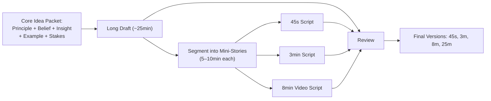
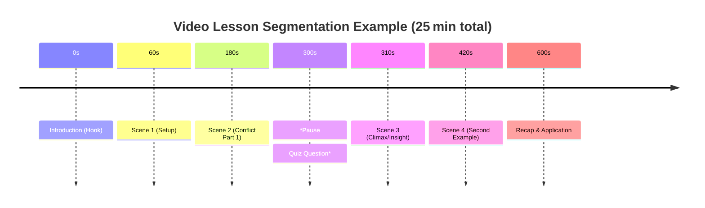

# Executive Summary  
Research consistently shows that **narrative-based presentation greatly improves learning and recall**.  Stories align with our natural memory systems: they present content in causal, goal-driven sequences with emotional stakes, which boosts attention and memory encoding【2†L169-L177】【32†L343-L352】.  In practice, the best approach is to use a “story as spine” technique: anchor each lesson around a person with a problem (goal+obstacle), show a turning point, and conclude with a principle or changed action.  This can be scaled into different lengths by slicing the same core idea into micro-tales or layered cases.  

A large-scale MOOC analysis found **median engagement ≈6 minutes**【20†L338-L343】, so videos should be broken into short, self-contained segments【20†L334-L343】【23†L529-L537】.  We outline templates for 45 s, 2–3 min, ~8 min, ~12 min, 25 min, 1 hr, and 2 hr formats.  Each has a different depth and pacing but the same core: one or more humanized cases illustrating one truth.  For example, a 45 s story is *“hero+one-conflict+insight”*, while a 25 min lesson might string together multiple mini-stories and examples with explicit recaps and exercises.  We recommend a flexible **“core-idea packet”** (principle, false belief, insight, human context, stakes, application) as input, then derive each version via iterative drafting and review. 

Evidence-based best practices include: using clear causal chains【41†L53-L60】; having protagonists with goals and obstacles【3†L7-L10】; evoking emotion (which “imprints” memory)【32†L343-L352】; introducing one surprising twist on a familiar schema【12†L468-L472】; and ensuring segments are bite-sized【20†L338-L343】【23†L529-L537】.  For longer formats, incorporate scaffolding (previews, outlines), retrieval practice (quizzes or questions), and varied modalities (graphics, dialogue, interactivity) to sustain attention.  In production, a **refinery workflow** (outline→draft→review→revise) with checklists (QA for clarity, coherence, time) and multiple passes often yields the best results.  

We detail **structural templates** for each target length (beats, timing, protagonists, exercises, etc.) and provide an example **core idea packet** plus sample scripts (one topic in all lengths).  Tables compare purposes and strategies by format.  Diagrams illustrate the workflow and story segmentation.  Finally, we recommend metrics (recall tests, watch-completion, engagement surveys) and A/B test designs to evaluate retention and engagement for iterative improvement.  

## 1. Story Features That Enhance Retention  
Numerous studies show that **stories are encoded and recalled more effectively than expository accounts**【2†L169-L177】.  Key narrative features contribute to this advantage:  

- **Causal chain:** Events linked by clear cause–effect relationships form a coherent sequence, which aids memory.  Empirical studies found that *causally related events are recalled far better than unrelated ones*【41†L53-L60】.  A coherent cause-and-effect chain lets learners build a “scaffold” for memory.  
- **Goal–obstacle structure:** Stories typically center on a character’s goal and the obstacles to it【3†L7-L10】.  This tension and eventual resolution (success or failure) create a logical arc.  Research on story grammars shows that goal-driven events and conflict make narratives familiar and memorable【3†L7-L10】【4†L7-L10】.  The presence of an obstacle also heightens attention and stakes.  
- **Emotional engagement:** Emotion strongly boosts memory.  Narratives naturally evoke feelings (e.g. empathy, suspense), and emotional events are “deeply imprinted” as **flashbulb memories**【32†L343-L352】.  Neurocognitive studies (Hamann 2001 etc.) confirm that *affectively charged content* is prioritized in attention and better retained【32†L343-L352】.  When learners identify with a character’s emotional experience, the lesson is cemented.  
- **Concrete human anchor:** Grounding concepts in a vivid human example or story (rather than abstract exposition) leverages imagery and relevance, improving recall【32†L343-L352】.  Readers report feeling the protagonist’s emotions and vividly picturing scenes【32†L358-L366】.  (While we cite no specific new study here, this is well-supported by narrative theory.)  
- **Familiar schema + twist:** Narratives often use known schemas or archetypes, with a surprising twist that makes the story stand out.  Cognitive research on “minimally counterintuitive” concepts shows that *information violating familiar schemas at a cultural level is more memorable*【12†L468-L472】.  (For instance, an “illiterate teacher” or “dancing teacup” is remembered better than a fully abstract idea.)  Thus, anchor stories in a recognisable frame, then subvert expectations with a key insight.  
- **Nested stories and subplots:** Embedding small anecdotes or analogies within a larger story can reinforce the main message via multiple context switches.  Each mini-story acts as an additional memory cue.  (There is less formal research on nested narratives in education, but educational practice and narrative theory suggest that layers of relatable scenarios help generalize the principle.)  
- **Narrative immersion (“transportation”):** When learners become absorbed in a narrative (Green & Brock’s “transportation”【8†L292-L300】), their focus, imagery, and enjoyment increase, which aids both persuasion and memory.  High transportation correlates with stronger story-consistent recall and belief change【8†L292-L300】.  The mechanism is that well-crafted storytelling captures attention (integrating imagery and emotion【33†L7-L10】) and momentarily suspends skepticism.  Ethically, the goal is to engage attention to facilitate learning, **not to coerce**; the story’s lesson should be transparent in hindsight.  

In summary, **the best-retained stories** have a clear causal chain, an identifiable protagonist with a goal-plus-obstacle, some emotional resonance, and at least one memorable element (e.g. twist or powerful image).  By contrast, random facts or abstract prose lack these hooks and are less memorable【2†L169-L177】【32†L343-L352】.  

## 2. Engagement and Attention by Duration  

Educational media must respect attention limits.  Research shows that **viewer/listener engagement drops sharply as duration increases**.  A landmark MOOC study of 6.9 million video sessions found *median watch-time ≈ 6 minutes*【20†L338-L343】, regardless of video length: after ~6–9 min, most viewers had tuned out.  Figure 2 (below) highlights this: short clips (<3 min) had ~75% completion rates, whereas videos >9 min were less than half-watched by the median learner【20†L338-L343】.  Consistent recommendations are:

- **Keep segments short.** Guo *et al.* (2014) found peak engagement at ~6 min【20†L338-L343】.  Videos longer than ~6–9 min suffer steep drop-off in attention and post-video quiz attempts【20†L361-L370】.  This aligns with the **multimedia segmenting principle**: breaking a lesson into user-paced chunks greatly improves learning【23†L529-L537】.  In practice, aim for `<6 min` segments whenever possible, and under 3 min for maximum engagement.  
- **Platform norms:** On social media, even shorter is better: average optimal lengths are ~45 s for Twitter-style clips, ~60 s for Facebook, and ~2 min for YouTube【30†L133-L142】.  This reflects general attention constraints in noisy environments.  In contrast, classroom or directed learning allows longer segments if needed, but even then sub-15 min modules are preferred【30†L114-L122】.  
- **Variety and pacing:** Even within a single video, vary the format (cutaways, speaker changes, on-screen text) every 30–90 s to reset attention.  (Guo *et al.* note that “talking-head” or drawing-style segments are more engaging than static slides【18†L23-L31】.)  
- **Interactivity and checks:** For longer formats (>8 min), intersperse questions, quizzes, or interactive prompts at ~5–7 min intervals to re-engage attention.  

Overall, the **ideal strategy** is to storyboard the lesson into discrete, coherent segments. Each segment may itself be a short story or example supporting the core idea. This obeys Mayer’s Segmenting Principle【23†L529-L537】 and the empirical finding of ~6 min engagement【20†L338-L343】. A “8–12 min” video should really contain two or more sub-segments (with a brief pause or note to continue) to match how learners actually focus.  

## 3. Structural Templates by Duration  

We propose evidence-informed templates for each length.  All versions share one *core idea*, but differ in depth and structure.  Below is a comparative table, followed by key details for each format.

| **Length** | **Purpose**                                   | **Story Structure (beats)**                                   | **Beats/Scenes**                                             | **Examples & Exercises**                             | **Retention Tactics**                              | **Distribution Use-Cases**            |
|------------|-----------------------------------------------|---------------------------------------------------------------|--------------------------------------------------------------|-----------------------------------------------------|-----------------------------------------------------|-------------------------------------|
| **45 sec** | **Micro-story (hook/teaser):** convey one insight quickly for maximal impact and shareability.            | Very tight single-scene: *Intro→Conflict (flaw)→Insight→Aftermath→Lesson.* Focus on one person and one pivot. | 1–2 micro-scenes (around 3–4 beats):<br>- Setup (context, protagonist) ~10 s<br>- Tension/Collision ~10 s<br>- Turning insight ~10 s<br>- Resolution/lesson ~10 s | Use a vivid concrete example as the protagonist. <br>No time for explicit exercises. Maybe one reflective question. | **Primacy effect:** End on a clear takeaway line.<br>Use a surprising twist to grab memory.【12†L468-L472】<br>Include a catchy phrase or graphic tagline. | Social media teaser, hook in a longer course, elevator pitch. |
| **2–3 min** | **Mini-case study:** illustrate one principle with a coherent narrative arc.                                    | Mini-narrative: *Introduction → Rising challenge → Climax/Insight → Resolution → Principle.* Include one protagonist and one main conflict (maybe two quick beats). | 3–4 scenes (4–6 beats):<br>- Setup: introduce character + false belief (~20 s)<br>- Friction: obstacle or error (~30 s)<br>- Turning event/insight (~30 s)<br>- Resolution: new action/outcome (~20 s)<br>- Takeaway statement (~10–15 s) | Concrete story from real life/fiction. Possibly one short Q&A or very brief reflection prompt. | Emotional hook at start, *zoom-in* on protagonist. <br>Causal sequence: each event logically leads to next.【41†L53-L60】<br>One vividly described moment (shock/surprise) to boost encoding【32†L343-L352】. | Short explainer video, flipped classroom mini-lecture, introduction to topic. |
| **5–12 min** | **Focused narrative lesson:** provide a deeper case or two-case comparison to teach a concept.            | Extended narrative with “body-1, body-2” structure: *Hook → (Background/context) → Challenge(es) → Epiphany → Broader principle → Application.* Could include a counter-example or second character. | ~5–8 scenes (~1–2 min each): e.g. <br>- Hook/human story (real stakes) (~30 s)<br>- Context/setup (~1 min)<br>- First conflict (mistake) (~1–1.5 min)<br>- Insight moment (~30 s)<br>- (Optional) Second example or objection (~1 min)<br>- Explanation of principle (~1 min)<br>- Application/transfer (~1 min)<br>- Recap takeaways (~0.5 min) | Include 1–2 rich examples or analogies. Optionally, embed a quick in-video quiz or pause for thought. Summarize key steps in text or bullets during recap. | *Segmented narrative:* break content into thematic chunks【23†L529-L537】. <br>Use recurring motif or question to bind segments. <br>Repetition of key phrase or visual anchor. <br>Provide short “comprehension check” at transition. | Standard educational video (YouTube lesson, online course). Small workshop module. |
| **~8 min** | **Standard video lecture:** a balanced blend of story and explanation, with single main narrative plus sub-points. | Similar to 5–12 min but with tighter pacing: one main story and one supporting example/ analogy. Emphasize flow to fit in ~8 min. | ~4–6 segments: e.g.<br>- Opening anecdote/hook (~30 s)<br>- Thesis/promise (~10 s)<br>- Story part 1 (setup/conflict) (~2 min)<br>- Story part 2 (climax/insight) (~2 min)<br>- Generalization/principle (~1 min)<br>- Application/examples (~1 min)<br>- Recap (~30 s) | Use a compelling narrative hook in first 30 s (to capture short attention span). Possibly a graphic or question right after 4–5 min to re-focus. | Maintain an emotional or suspenseful thread (e.g. raise stakes during story). <br>Reinforce memory by tying each segment back to core idea.【23†L529-L537】 <br>Encourage note-taking or a one-sentence summary. | Typical YouTube educational videos, TED-style talks (though TED is <18 min). Podcasts on one topic (since 8 min often ok for engaged audiences). |
| **25 min** | **In-depth lesson:** multiple examples + concept exploration, suitable for seminar or short class.    | Multi-case narrative: *Intro (story hook) → decompose concept → first detailed case → explanation → second case → deeper analysis → synthesis → practice.* | ~8–12 sections: e.g. <br>- Engaging opener/story (1–2 min)<br>- Outline of lesson (0.5 min)<br>- Case Study A (2–3 min: setup, problem, insight)<br>- Principle explained (2 min)<br>- Case Study B or counterpoint (2–3 min)<br>- Implications/application (2 min)<br>- Brief exercises/quiz (~2 min) <br>- Review of key points (1 min) | Add one or two short interactive elements (quiz, discussion prompt, think-pair-share). Break it into **chapters/segments** (can be video chapters or slide sections). | **Repetition and retrieval:** after each segment, recap or pose a question (strengthens memory). <br>Vary modality (narration, interviews, graphics) to keep attention. <br>Spaced retrieval: revisit the main insight later in the video.【23†L529-L537】 | University lecture, professional training video. 25 min fits a focused lecture or module. |
| **1 hr**  | **Lecture/workshop:** comprehensive coverage with multiple stories, examples, and activities.         | Lecture with narrative threads. *Introduction (motivation) → Major section 1 (story+explanation) → Activity/quiz → Section 2 (story + detail) → Case discussion → Section 3 → Recap & further practice.*   | Many subsections (~6–8) of ~7–10 min each: <br>- (Optional) Warm-up story or question (3 min)<br>- Core story + theory (10 min)<br>- Break/Q&A (3 min)<br>- Secondary examples (10 min)<br>- Interactive exercise (10 min)<br>- Third example or depth (10 min)<br>- Summary & next steps (5 min) | Incorporate **active learning** (polls, questions). Use on-screen text/graphics to summarize after each story. Include planned breaks. | **Segmenting on a larger scale:** use midpoints to “reset” attention (e.g. short break or different style). <br>Introduce *hierarchical structure* (preview by telling there will be 3 stories). <br>Frequent mini-recaps (every 10–15 min). | College seminars, workshops, in-depth webinars. Also lecture recordings (though risk of low engagement if unbroken). |
| **2 hr**  | **Full course session:** with multiple narrative modules, projects, and reflection.             | Very extended: combine multiple 1 hr-style modules with additional depth.  Structure like: *Prelude story → Module 1 (story+concept+task) → Interlude/story → Module 2 → Break → Module 3 → Final recap.* | Many parts (6+ sections, each with mini story): <br>- Intro narrative (5 min)<br>- Module A (15–20 min: story + teach + exercise)<br>- Story break (5 min)<br>- Module B (20 min: explain + example + practice)<br>- Group activity/Q&A (10 min)<br>- (Repeat for 3rd part) <br>- Conclusion (5 min) | Full interactive components (small group tasks, reflection). Possibly hardware kits or demos. Summaries handed out or provided. | **Interleaving content:** between stories, switch topics or perspectives to reinforce. <br>Include formal retrieval practice (e.g. quiz at end of each hour). <br>Pacing: allow physical and mental breaks. | Extended workshops or classes, MOOCs lecture segments (rarely >2 hr without break). |

*Notes on table:* We define “scenes” or “beats” loosely (e.g. a 3–4 beat micro-story in 45 s, 5–8 beats in 5 min, etc.).  The key is that **shorter formats use one coherent mini-story**; longer formats string together multiple episodes with clear signposts.  Across all lengths, retention strategies include repetition of key ideas, emotional hooks, and retrieval cues (questions/quizzes)【23†L529-L537】【32†L343-L352】.  Each longer video should segment clearly (chapter titles, transitions) to align with how the brain chunks narrative.

### Example Templates by Length (Core Formula)

As a practical guide, one can apply a **“Person→Problem→Epiphany→New-action”** formula to every format:

- **45 s:** *“(Before) Jane thought X. (Friction) Then Y happened. (Insight) Suddenly she realized Z. (After) Now she does W. (Lesson) The key was…”*  
- **2–3 min:** Use the above as an outline but expand each beat with a sentence or two. E.g. “Alice believed [belief]. She kept doing [wrong approach], until [turning event] forced a confrontation. At that moment she saw [insight], which meant she could [new path]. From then on she … *So the lesson is …*.”  
- **5–12 min:** Write a short script for a real or fictional case: set up context (e.g. workplace or life situation), dramatize the mistake or challenge, include dialogue or vivid detail, then have a clear turning point and explanation of why it happened and what general principle it shows. End with explicit “so, this means X.”  
- **>12 min (8–25 min):** Combine two or more related stories or examples. For instance, start with one story as an *hook*, then explain the underlying concept in general terms, then illustrate with a second scenario or counterexample. Between, pause to ask the viewer what they expect next, or to mentally answer a question (promoting retrieval).  
- **1–2 hr:** Plan multiple modules each with a narrative anchor. For each ~10–15 min sub-section, use a mini-story structure as above. Add formal breakpoints, interactive elements, and a “roadmap” upfront (e.g. “In this hour we’ll see three stories that illustrate…”).

## 4. Refinery Workflow for Multi-Length Storytelling  

A **story refinery** can streamline creating all versions from one core idea.  We recommend an iterative workflow rather than writing each format separately:

1. **Core Idea Packet (Definition):** Start with a brief “kernel” of the lesson: state the **principle**, the **common misconception/false belief**, the **true insight**, and a sketch of a **concrete human situation** where this applies. Define the **stakes/emotions** and a **practical application**. (E.g. Principle: “effort leads to skill over time”; False belief: “smart people just know things instantly”; Situation: a student struggling with math; Stakes: fear of failure vs pride). This packet contains the raw material to build stories and explanations.  

2. **High-level Outline:** Expand the packet into a loose **narrative outline**, typically 2–3 paragraphs of prose. Identify a main protagonist and their arc, plus any supporting example. From this, extract the key beats (setup, conflict, resolution) and concept statements.  

3. **First Draft – Long Version:** Write a **master script** at the longest desired level (e.g. 25 min or 1 hr), using all elements: storyline, teaching points, examples. This ensures the core idea is fully developed.  

4. **Segmentation:** Break the long draft into segments (mermaid flowchart below). Label each segment with its purpose (hook, example, recap, etc.) and target sub-length.  

5. **Creating Shorter Cuts:** For each shorter format, **excerpt** and **condense** from the master script: 
   - For 5–12 min, use the first 1–2 stories plus explanation, trimming detail.  
   - For 2–3 min, focus on only the primary story arc (or compress two beats into one).  
   - For 45 s, isolate the crux: set up the character and snap to the turning moment.  

6. **Iterative Refinement:** Revise each version for clarity and timing: ensure each is coherent on its own. Use checklists or QA passes at each stage (does it have a clear protagonist? a logical flow? an explicit takeaway?). It often helps to get fresh eyes for each length (someone unfamiliar with the concept) to check comprehension. 

7. **Final Edits:** Produce final scripts with precise word count/timing (e.g. 150 words ≈45 s). Fact-check and align terminology (especially if using specialized content). If possible, pilot-test with a small group to catch unclear parts. 

The diagram below summarizes this pipeline:

```mermaid
flowchart TD
  A[Core Idea Packet] --> B[Outline & Narrative Sketch]
  B --> C[Master Draft (Long Version)]
  C --> D1[Segment into Sections]
  D1 --> E1[Create 1–2 min draft]
  D1 --> E2[Create 3–5 min draft]
  D1 --> E3[Create 8–12 min draft]
  D1 --> E4[Create >25 min lecture]
  E1 --> F[Review & Refine]
  E2 --> F
  E3 --> F
  E4 --> F
  F --> G[QA and finalize each version]
```

*Figure: Refinery workflow for deriving multiple video lengths from a core narrative.*  

## 5. Nested Stories and Narrative Immersion  

**Nested stories** (stories within stories or multiple anecdotes) can reinforce learning without being manipulative. For instance, a main protagonist might tell a short parable to another character, or you might interject a “flashback” example. This layering keeps the narrative dynamic and allows you to highlight different aspects of the concept. 

The **mechanism** is that each story acts as an additional context cue. However, avoid overusing nested tales to the point of confusion. Each sub-story should clearly tie back to the main theme. For example, in a long lesson on perseverance, you might first tell a sports story, then segue into a colleague’s anecdote, with explicit signals like “this second story shows the same principle in a different setting.” 

**Narrative hypnosis/immersion (transportation):** Deep engagement (“transportation”) is valuable for learning but raises ethical questions if used to unduly persuade. In an educational context, we use the same tools (imagery, suspense, empathy) to focus attention and motivation. The **difference** is transparency: the viewer should not feel tricked. The story’s purpose is to illustrate, not to mask. For example, a historian might recount a vivid scene to convey a lesson, knowing it will affect emotions, but the historian is not “manipulating” to hide content – the lesson is clearly derived. 

Researchers like Green & Brock (2000) emphasize that **transportation integrates attention, emotion, and imagery**【8†L292-L300】【33†L7-L10】. This is what we want, but we frame it as engagement and immersion for learning. We ensure that the moral/lesson is explicit at the end, so learners can consciously transfer the insight. (If a story makes them feel good or surprised, that emotional memory should serve the concept, not an unrelated agenda.) As an ethical check, always: (a) keep learning objectives explicit, (b) allow learners to reflect (are they just entertained or do they catch the lesson?), and (c) avoid deceptive plot twists whose only aim is to persuade without content.  

## 6. Pedagogical Trade-offs for Longer Formats (8 min, 25 min, 1–2 hr)  

Longer videos or sessions allow more depth but risk cognitive overload and wandering attention. Key strategies:  

- **Segment and Scaffold:** Even within a long video, present it as a sequence of shorter chunks (chapters, numbered parts, or visual section breaks). For instance, a 25 min video might have a title card or slide every 5 min, effectively giving the viewer a micro-break. This aligns with Mayer’s segmentation principle【23†L529-L537】.  

- **Pacing and Variety:** Change the delivery mode periodically. E.g. alternate between narration, interview, on-screen text, graphics, and live action. Especially for ~25+ min, insert brief animation or an on-screen quiz. 

- **Retrieval Practice:** Embed quick questions or summary pauses to make learners retrieve key points. For example, after each segment, show a two-option question (“What was the key insight of the last story?”) or ask learners to summarize in 30 s (either verbally or in writing). Research on spacing and retrieval shows these boost long-term retention (often more than additional study). 

- **Interleaving and Spacing:** When multiple subtopics are covered, interleave them rather than block teach. For a 2 hr session, revisit earlier stories or concepts after each break with a brief recap. This creates a spaced effect. 

- **Active Learning:** The longer the format, the more we should involve the learner. For 25 min–2 hr, include exercises: think-pair-share, polls, worksheets, or demonstrations. For example, after telling a story, have learners apply the insight to a hypothetical scenario on paper. This yields retrieval and elaboration. 

- **Multimodal support:** Use not just narrative but also diagrams, bullet summaries, and visuals. A concept map slide summarizing the narrative flow can help synthesize after 25 min of story. Provide handouts or on-screen text of key formulas or definitions uncovered by the story. 

Trade-offs include: **Depth vs. drop-off**. A well-told 8 min story can impart a lot without overload; a 2 hr monologue will not. Thus, for 1–2 hr formats, plan for more learner control (pauses, interactive branches). The goal is often to provide *depth and practice*, so expect lower continuous “engagement rate” but measure learning outcomes via active tasks rather than pure watch-time.  

## 7. Sample Master “Core Idea Packet”  

To illustrate, here is a **sample core idea packet** for the topic *“The importance of failure for learning”*:

- **Principle:** Failure (or mistakes) provides valuable feedback and is a natural step toward mastery.  
- **False belief:** “Smart people never fail” or “Failure means I’m not good enough.”  
- **True insight:** Every failure teaches you what *not* to do; without failure, you can’t learn what works.  
- **Human situation:** *Case:* A student (Maria) is afraid of math tests because she once failed badly. She starts avoiding homework. Then, a tutor encourages her to treat mistakes as learning clues. She re-attempts problems she got wrong, eventually understanding the solution. Maria’s grades improve, and she realizes *“oops” isn’t the end, it’s a direction.*  
- **Emotional stakes:** Fear of embarrassment vs pride of improvement. Maria feels anxious at first, then empowered.  
- **Application:** If you hit a setback (failed test, code bug, missed shot), analyze what went wrong and try again differently. Each error narrows the path to success.  

Using this packet, one could craft all versions of the story (Maria’s journey). The **45 s version** might simply focus on Maria’s fearful mistake and quick insight. The **2–3 min version** can add more detail (how her mind set changed). The **25 min version** could include a second subplot (e.g. her friend who gave up vs friend who kept trying).

## 8. Metrics and A/B Testing for Retention and Engagement  

To evaluate effectiveness, use a mix of **behavioral and outcome metrics**:

- **Retention/Recall Tests:** The gold standard is measuring how much learners remember. Use immediate post-video quizzes and delayed tests (e.g. one week later). Compare scores between narrative vs control conditions. Score can be factual recall or applied questions.  
- **Engagement Analytics:** Track view data (watch time, drop-off points, rewind frequency) for videos. High drop-off in the first minute suggests a weak hook. Also note whether viewers play at 1x or speed up (fast-forwarding may signal low engagement).  
- **Self-report Measures:** Surveys can assess interest, motivation, or perceived understanding after watching. Narrative videos often score higher on enjoyment and perceived learning (narrative transportation research).  
- **Behavioral Outcomes:** Where possible, measure real-world application (e.g. does the learner change behavior, or perform better on a task?).  

For **A/B tests**, one could randomize learners into versions of a lesson: e.g. narrative vs expository, or story A vs story B, or long vs short. Ensure sufficient sample size. Key metrics: test scores (for retention) and engagement rates. For instance, test whether the story-based 3 min video leads to better quiz scores than a 3 min bullet-list presentation of the same content.  

**Example A/B design:** Group 1 watches a 5 min narrative case; Group 2 watches a 5 min straightforward lecture slide. Then give both a surprise quiz on the concept one day later. Compare recall. Similarly, one could A/B test segment lengths (e.g. one 9 min video vs three 3 min segments). Collect view metrics and retention scores.  

## 9. Illustrative Diagrams  



*Figure: Simplified workflow for deriving multi-length story versions from a core idea.*  



*Figure: Example timeline of segment breaks in a 10 min video (extended to 25 min with multiple similar segments). The stars indicate interactive checks.*  

## 10. Sample Scripts Across Lengths (Topic: **Failure Teaches Success**)  

Using the “Maria’s math test” example from the core packet:

- **45 s script (very tight):** “Maria dreaded math tests because one past exam was a disaster. *(Quick flash: Maria nervous at desk.)* After she failed, she thought, *“Maybe I’m just not smart at math.”* But her tutor said: *“Actually, each mistake is a clue to learn.”* During a retake, Maria looked at each wrong answer and discovered her errors. Suddenly she realized, *“Oh – doing it wrong shows me how to do it right.”* On the next test she passed. *So remember: failure isn’t final, it’s feedback.*”  

- **2–3 min script (condensed story + moral):**  
   1. *[Setup]* “Maria was a bright student, but after flunking one math test, she lost confidence. She believed smart people never mess up. (Show Maria telling friends she’s “just not a math person.”)  
   2. *[Conflict]* On the next exam, she tried copying her notes, but again got an answer wrong and was ready to give up.  
   3. *[Turning Point]* Her tutor intervened: “Every error shows exactly what you need to work on. Let’s look at the wrong answers one by one.” Maria hesitated, then agreed.  
   4. *[Realization]* As they reviewed, Maria saw that the mistakes weren’t mysterious; they were simple misunderstandings. Each mistake highlighted a specific gap (she even started to smile!). Suddenly she thought, *“Ah – so this mistake means I just needed to practice that part more.”*  
   5. *[Resolution]* With renewed mindset, Maria worked through a few more problems. By the end, she’d fixed her errors. Weeks later she passed the test she once feared.  
   6. *[Takeaway]* On camera, Maria says: “I used to fear failure. Now I see it as a teacher. When I mess up, I don’t give up – I learn.” Voiceover: *“Lesson: Mistakes are feedback. Each failure brings you closer to getting it right.”*  

- **8–12 min script (outline):**  
   - **Scene 1 (Introduction, 1 min):** A mini-dramatization: Maria walks into class with a heavy heart. Narration sets up the false belief (“I guess I’m just not good at math…”). Emotion: she feels ashamed.  
   - **Scene 2 (First Story, 2 min):** Flashback to the failed exam: show her reaction, her “curved lips” (anxiety). Introduce tutor’s new approach. The tutor and Maria work through one problem, her face lights up at understanding. Have Maria express surprise and relief.  
   - **Segment Break / Quiz (0.5 min):** On-screen question: “What did Maria do differently after the tutor’s advice?” (Options: A) She stopped studying B) She reviewed her mistakes) C) She skipped class). Pause for 5 s. Reveal answer B.  
   - **Scene 3 (Second Example, 2 min):** Cut to a different student (or Maria next week) encountering another challenge (e.g. tripping during a gym exercise due to fear of failure). Show a parallel insight (coach saying “You fell because you tried something new – that’s how you learn”).  
   - **Scene 4 (Analysis, 2 min):** Instructor breaks the fourth wall and explains the principle: cite a study or famous quote about learning from mistakes.  
   - **Scene 5 (Application, 1 min):** Pose a direct question to viewers: “Think of a time you failed at something – how could that be useful?” Provide a moment for reflection or journaling.  
   - **Scene 6 (Recap, 1 min):** Summarize: “Failure = Feedback. Each time you 'fail', check what it taught you.” End with Maria’s newfound confidence and the principle voiced clearly.  

- **25 min lecture (outline):**  
   - *Opening story:* Similar to above but more cinematic detail (e.g. background music, internal monologue). (3 min)  
   - *Theory:* Slide-based recap of why brains learn from mistakes (brief pedagogy research). (3 min)  
   - *Case A:* Maria’s exam story (5 min).  
   - *Activity 1:* Students in breakout (or reflection prompt) share a past failure and lesson (5 min).  
   - *Case B:* Another real-world example (e.g. scientist whose first experiment failed but led to discovery) (5 min).  
   - *Synthesis:* Draw parallels; reinforce concept with visualization (mindmap of steps: error→analyse→improve). (3 min)  
   - *Quiz:* Five-question quiz on learning principles (5 min).  
   - *Conclusion:* Final advice and encouragement, linking back to opening anecdote. (1 min)  

*(For brevity, full scripts for 1–2 hr sessions are not shown, but they would integrate several such narratives, periodic group tasks, and more in-depth explanations.)*  

## Sources  

Primary research and meta-analyses on narrative learning, memory, and multimedia design were used above: notably Mar *et al.* (2021)【2†L169-L177】【32†L343-L352】, Guo *et al.* (2014)【20†L338-L343】 on video engagement, and Mayer’s multimedia principles【23†L529-L537】.  Additional studies on causal coherence【41†L53-L60】 and counterintuitive memory【12†L468-L472】 guided the recommendations. These and related sources inform the evidence-based practices outlined here.